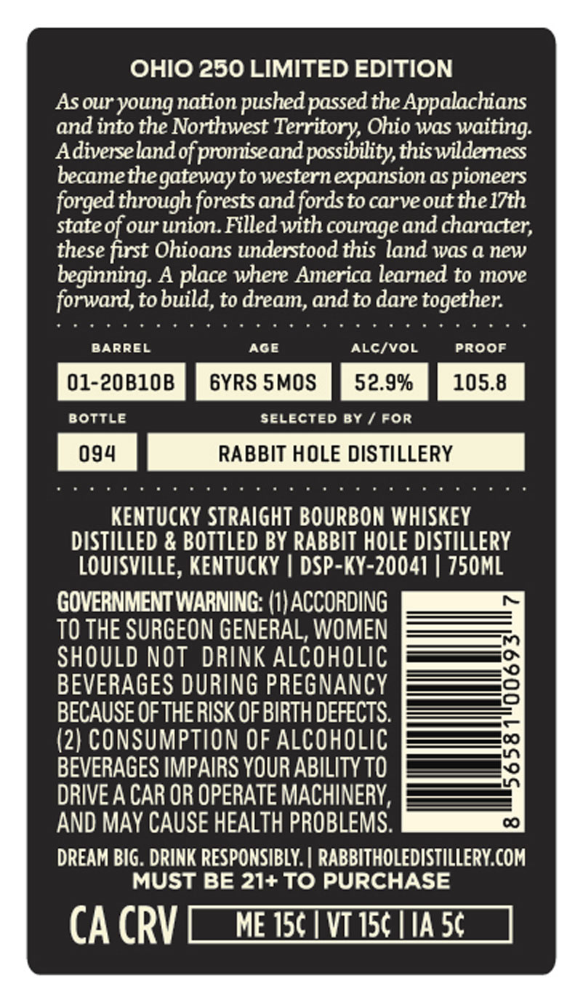
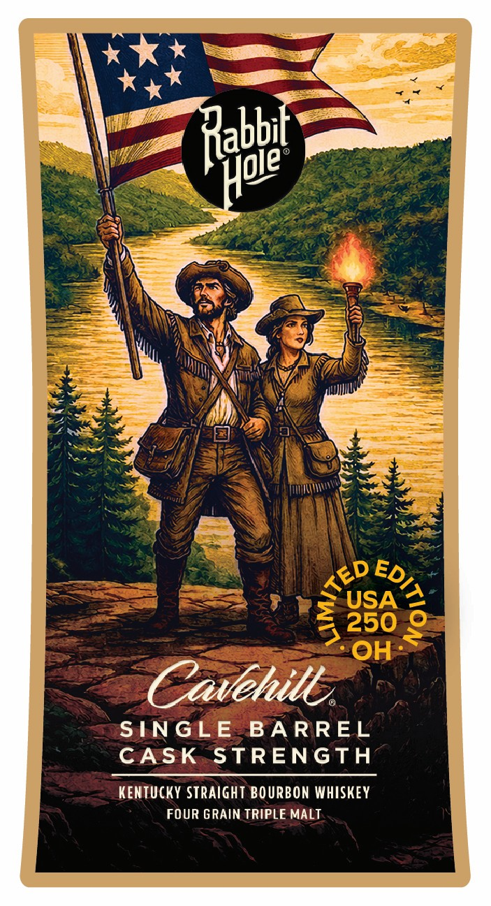

# TTB COLA Label Images - TTBID 26138001000559

**Brand Name:** RABBIT HOLE DISTILLERY

**Issue Date:** 05/28/2026

**Origin Code:** 22

**Product Class/Type:** 101

**Source:** [TTB Public COLA Registry](https://ttbonline.gov/colasonline/viewColaDetails.do?action=publicFormDisplay&ttbid=26138001000559)

## Label Images

### Back Label

### Front Label

### Label 2

## Extracted Label Text

*Text extracted via OCR - may contain errors*

*1 image(s) excluded: text did not meet readability threshold*

**Detected Proof:** 105.8
**Detected Age:** 6 Years

### Back Label

OHIO 250 LIMITED EDITION
Asour youngnation pushedpassed the Appalachians
and into the Northwest Territory Ohio was waiting:
Adiverselandof promiseandpossibility,thiswilderness
becamethegatewayto western expansion aS pioneers
forged through forestsand fordsto carveout the l7th
stateof our union Filled with courage and character;
these first Ohioans understood this land was a new
beginning: A place where America learned to move
forward,tobuild, to dream,andto dare together:
BARREL
AGE
AlcIvOL
PROOF
01-20B1OB
6YRS SMOS
52.9%
105.8
BoTTLe
selected By
For
094
RABBIT HOLE DISTILLERY
KENTUcKY STRAIgHT BOURBON WHISKEY
DISTILLED & BOTTLED BY RABBIT HOLE DISTILLERY
LouIsVILLE, KeNtuckY
DSP-KY-20041 | Z50ML
GOVERNMENT WARNING: (1| ACCORDING
TO THE SURGEON GENERAL, WOMEN
SHOULD NOT DRINK ALCOHOLIC
BEVERAGES DURING PREGNANCY
BECAUSE OF THERISK OF BIRTH DEFECTS.
1
(2) CONSUMPTION OF ALcOHOLIC
BEVERAGES IMPAIRS YOUR ABILITY TO
DRIVE A CAR OR OPERATE MACHINERY,
AND MAY CAUSE HEALTH PROBLEMS.
DREAM BIG . DRINK RESPONSIBLY. | RABBITHOLEDISTILLERY COM
MUST BE 21+TO PURCHASE
CA CRV
ME J50
VT I50 IIA 5c

### Front Label

Rahbe
USA
4 250
OH
Cavehill
SINGLE
BA RREL
CASK
STRENGTH
KENTUCKY Straight BOURBON WHISKEY
FOUR GRAIN TRIPLE MALT
Hoie
TED
9
