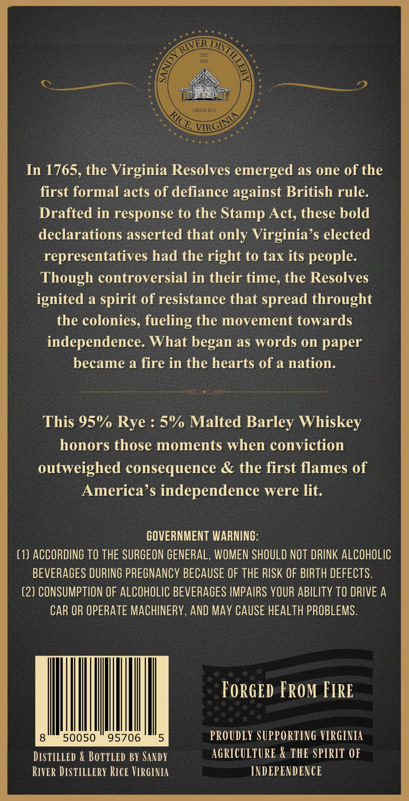
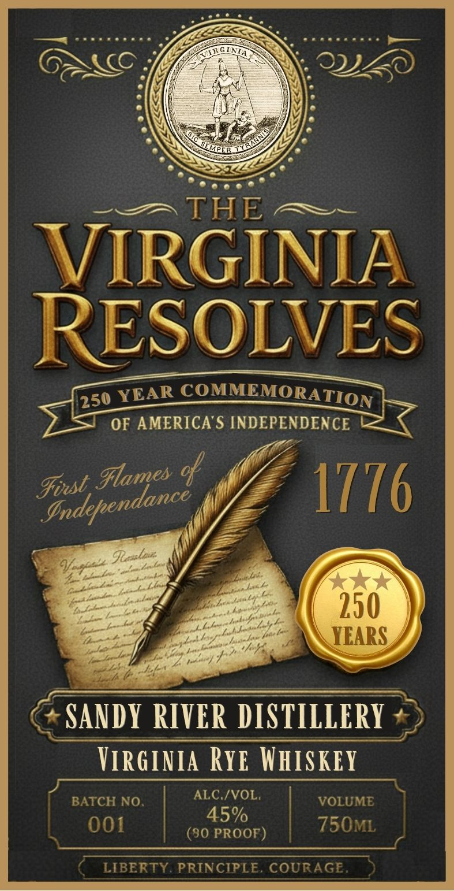

# TTB COLA Label Images - TTBID 26138001000578

**Brand Name:** SANDY RIVER DISTILLERY

**Fanciful Name:** VIRGINIA RESOLVES

**Issue Date:** 05/26/2026

**Origin Code:** 05

**Product Class/Type:** 142

**Source:** [TTB Public COLA Registry](https://ttbonline.gov/colasonline/viewColaDetails.do?action=publicFormDisplay&ttbid=26138001000578)

## Label Images

### Back Label

### Label 1

## Extracted Label Text

*Text extracted via OCR - may contain errors*

**Detected Proof:** 90

### Back Label

CIBCIMC
In 1765, the Virginia Resolves emerged as one of the
first formal acts of defiance against British rule:
Drafted in response to the Stamp Act, these bold
declarations asserted that only Virginia'$ elected
representatives had the right to tax its people:
Though controversial in their time, the Resolves
ignited a spirit of resistance that spread throught
the colonies, fueling the movement towards
independence: What began as words on paper
became a fire in the hearts of a nation.
This 95%/
5% Malted Barley Whiskey
honors those moments when conviction
outweighed consequence
the first flames of
America'$ independence were lit:
GOVERNMENT WARNING:
(1) ACCORDING TO THE SURGEON GENERAL, WOMEN SHOULD NOT DRINK ALCOHOLIC
BEVERAGES DURING PREGNANCY BECAUSE OF THE RISK OF BIRTH DEFECTS:
(2) CONSUMPTION OF ALCOHOLIC BEVERAGES IMPAIRS VOUR ABILITY TO DRIVE A
CAR OR OPERATE MACHINERY, AND MAY CAUSE HEALTH PROBLEMS.
FoRGED FRoM FIRE
50050
95706
5
PROUDLY SUPPORTING VIRGINIA
DISTILLED & BOTTLED BY SANDY
AGRICULTURE & THE SPIRIT OF
River DISTILiErY RIcE VIRGiNIA
INDEPENDENCE
RICE
VIRGINL
Rye :

### Label 1

THE
VIRGINIA
RESOLVES
COMMEMORA
OF AMERICAS INDEPENDENCE
cp
Fist
1776
Ilalae:
V
L
250
YEARS
SANDY RIVER DISTILLERY
VirGinia Rye WhISKEY
ALC /VOL,
BATCH NO.
VOLUME
45%
001
(90 PROOF)
750ML
LIBERTY PRINCIPLE. COURAGE
YEAR
TION
250
%lames
Independance
