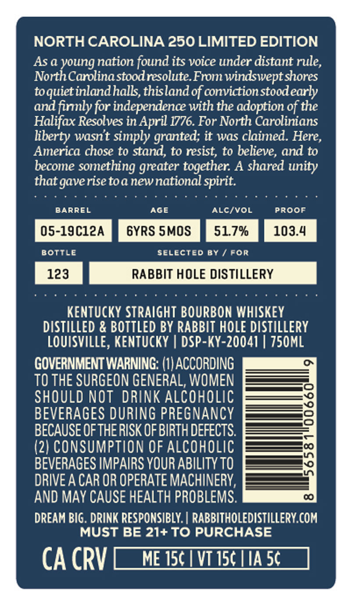
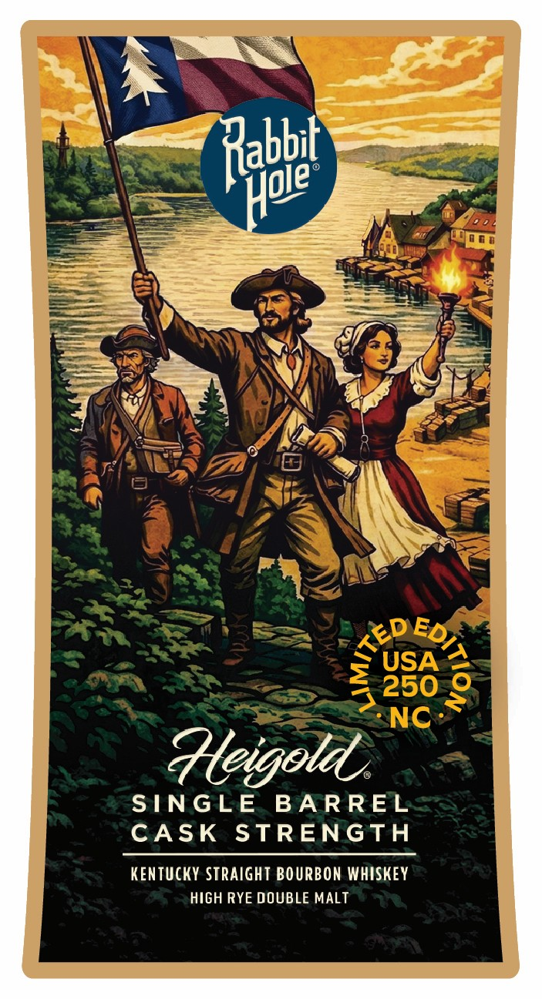

# TTB COLA Label Images - TTBID 26138001000614

**Brand Name:** RABBIT HOLE DISTILLERY

**Issue Date:** 05/28/2026

**Origin Code:** 12

**Product Class/Type:** 101

**Source:** [TTB Public COLA Registry](https://ttbonline.gov/colasonline/viewColaDetails.do?action=publicFormDisplay&ttbid=26138001000614)

## Label Images

### Back Label

### Front Label

### Label 2

## Extracted Label Text

*Text extracted via OCR - may contain errors*

*1 image(s) excluded: text did not meet readability threshold*

**Detected Proof:** 103.4
**Detected Age:** 6 Years

### Back Label

NORTH CAROLINA 250 LIMITED EDITION
As a young nation found its voice under distant rule,
North Carolina stoodresolute From windswept shores
toquiet inlandhalls,thisland of conviction stoodearly
and finly for independence with the adoption of the
Halifax Resolves in April 1776. For North Carolinians
liberty wasnt simply granted; it was claimed. Here,
America chose to stand, to resist, to believe, and to
become something greater together: A shared
that gaverise toa newnational
BARREL
AGE
AlcivOL
PROOF
05-19C12A
6YRS SMOS
51.7%
103.4
BOTTLe
SeLected By
For
123
RABBIT HOLE DISTILLERY
KenTuckY STRAIGHT BOURBON WHISKEY
diStILLED & BOTTLED BY RABBIT HOLE DISTILLERY
LOUISVILLE, KentuckY
DSP-KY-20041 | 750ML
GOVERNMENT WARNING: (I) ACCORDING
TO THE SURGEON GENERAL, WOMEN
SHOULD NOT DRINK ALCOHOLIC
BEVERAGES DURING PREGNANCY
BECAUSE OFTHERISK OF BIRTH DEFECTS
1
(2) CONSUMPTION OF Alcoholic
BEVERAGES IMPAIRS YOUR ABILITY TO
DRIVE A CAR OR OPERATE MACHINERY,
AND MAy CAUSE HEALTH PROBLEMS.
DREAM BIG . DRINK RESPONSIBLY. | RABBITHOLEDISTILLERY COM
MUST BE 21+TO PURCHASE
CA CRV
ME 156
VT I50 IA 5c
unity
spirit.

### Front Label

Rahbet
USA
250
NC
Heigold
SNGLE
BA RREL
CASK
STRENGTH
KENTUcKY StRaIght BOURBON WHISKEY
HIGH RYE DOUBLE MALT
Hpie
TED;
2
