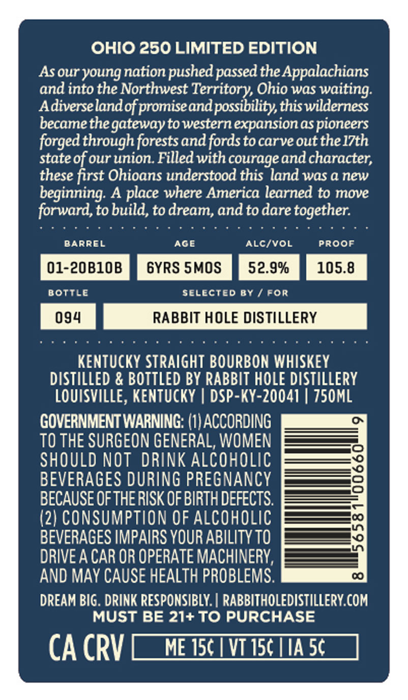
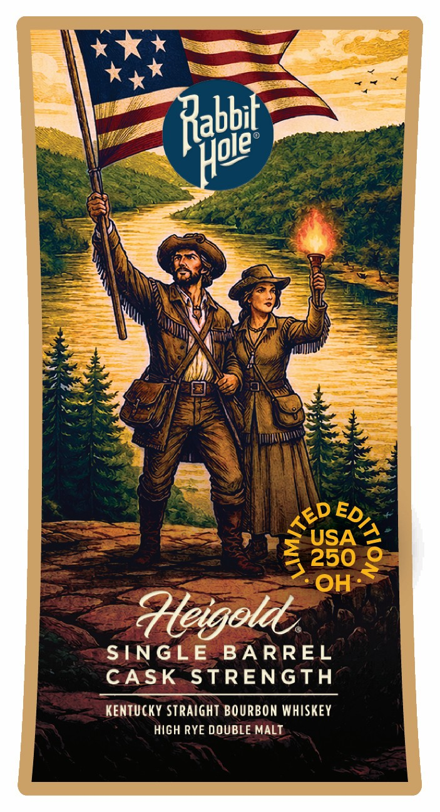

# TTB COLA Label Images - TTBID 26138001000620

**Brand Name:** RABBIT HOLE DISTILLERY

**Issue Date:** 05/28/2026

**Origin Code:** 12

**Product Class/Type:** 101

**Source:** [TTB Public COLA Registry](https://ttbonline.gov/colasonline/viewColaDetails.do?action=publicFormDisplay&ttbid=26138001000620)

## Label Images

### Back Label

### Front Label

### Label 2

## Extracted Label Text

*Text extracted via OCR - may contain errors*

*1 image(s) excluded: text did not meet readability threshold*

**Detected Proof:** 105.8
**Detected Age:** 6 Years

### Back Label

OHIO 250 LIMITED EDITION
Asour youngnation pushed passed the Appalachians
and into the Northwest Territory Ohio was
Adiverselandof promiseandpossibility thiswilderness
becamethe gatewayto western expansion as pioneers
forged through forestsand fordsto carve outthe I7th
state of our union  Filled with courageand character;
these first Ohioans understood this land was a new
beginning: A place where America learned to move
forward,to build, to dream, and to dare together
BARREL
AGE
AlcivOL
PROOF
01-20B1OB
6YRS SMOS
52.9%
105.8
BOTTLe
SeLected By
For
094
RABBIT HOLE DISTILLERY
KenTuckY STRAIGHT BOURBON WHISKEY
diStILLED & BOTTLED BY RABBIT HOLE DISTILLERY
LOUISVILLE, KentuckY
DSP-KY-20041 | 750ML
GOVERNMENT WARNING: (I) ACCORDING
TO THE SURGEON GENERAL, WOMEN
SHOULD NOT DRINK ALCOHOLIC
BEVERAGES DURING PREGNANCY
BECAUSE OFTHERISK OF BIRTH DEFECTS
1
(2) CONSUMPTION OF Alcoholic
BEVERAGES IMPAIRS YOUR ABILITY TO
DRIVE A CAR OR OPERATE MACHINERY,
AND MAy CAUSE HEALTH PROBLEMS.
DREAM BIG . DRINK RESPONSIBLY. | RABBITHOLEDISTILLERY COM
MUST BE 21+TO PURCHASE
CA CRV
ME 156
VT I50 IA 5c
waiting:

### Front Label

Rahbet
USA
4250
OH
?leigoldl
SINGLE
BA RREL
CASK
STRENGTH
KeNTUCKY Straight BOURBON WHISKEY
HIGH RYE DOUBLE MALT
Hoie
TED
2
