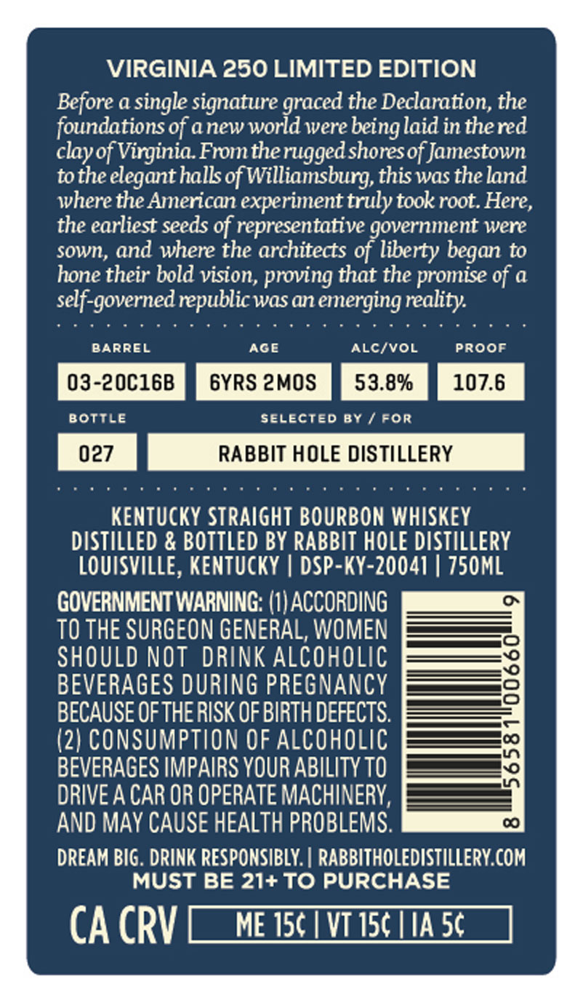
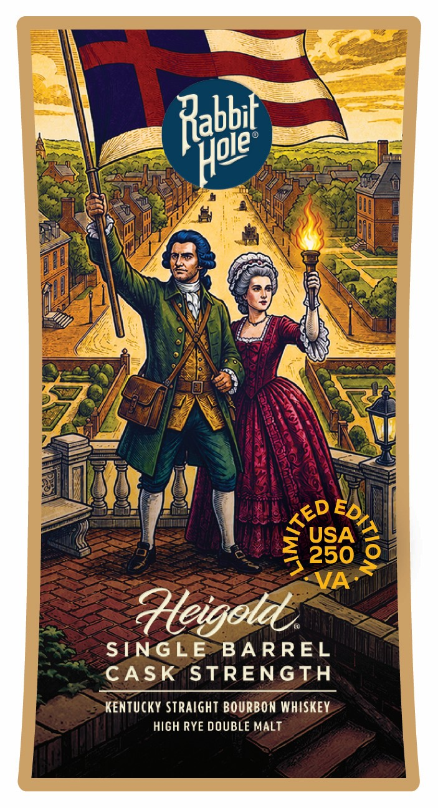

# TTB COLA Label Images - TTBID 26138001000626

**Brand Name:** RABBIT HOLE DISTILLERY

**Issue Date:** 05/28/2026

**Origin Code:** 12

**Product Class/Type:** 101

**Source:** [TTB Public COLA Registry](https://ttbonline.gov/colasonline/viewColaDetails.do?action=publicFormDisplay&ttbid=26138001000626)

## Label Images

### Back Label

### Front Label

### Label 2

## Extracted Label Text

*Text extracted via OCR - may contain errors*

*1 image(s) excluded: text did not meet readability threshold*

**Detected Proof:** 107.6
**Detected Age:** 6 Years

### Back Label

VIRGINIA 250 LIMITED EDITION
Before a single signature graced the Declaration, the
foundations of anew world were
laid in thered
clayof Virginia Fromthe rugged shoresof Jamestown
tothe elegant halls of Williamsburg,this was the land
where the American experiment truly took root. Here,
the earliest seeds of representative government were
sown, and where the architects of liberty
to
hone their bold vision, proving that the promise of a
self-governed republic was an emerging =
BARREL
AGE
AlcivOL
PROOF
03-20C16B
6YRS 2MOS
53.8%
107.6
BOTTLe
SeLected By
For
027
RABBIT HOLE DISTILLERY
KenTuckY STRAIGHT BOURBON WHISKEY
DISTILLED & BOTTLED BY RABBIT HOLE DISTILLERY
LOUISVILLE, KentuckY
DSP-KY-20041 | 750ML
GOVERNMENT WARNING: (I) ACCORDING
TO THE SURGEON GENERAL, WOMEN
SHOULD NOT DRINK ALCOHOLIC
BEVERAGES DURING PREGNANCY
BECAUSE OFTHERISK OF BIRTH DEFECTS
1
(2) CONSUMPTION OF Alcoholic
BEVERAGES IMPAIRS YOUR ABILITY TO
DRIVE A CAR OR OPERATE MACHINERY,
AND MAy CAUSE HEALTH PROBLEMS.
DREAM BIG . DRINK RESPONSIBLY. | RABBITHOLEDISTILLERY COM
MUST BE 21+TO PURCHASE
CA CRV
ME 156
VT I50 IA 5c
being'
began
reality:

### Front Label

Rakbet
USA
4 250
2
VA
?leigotd
SINGLE
BA RREL
CASK
STRENGTH
KENTUCKY Straight BOURBON WHISKEy
HIGH RYE DOUBLE MALT
Hoie
TED
8
