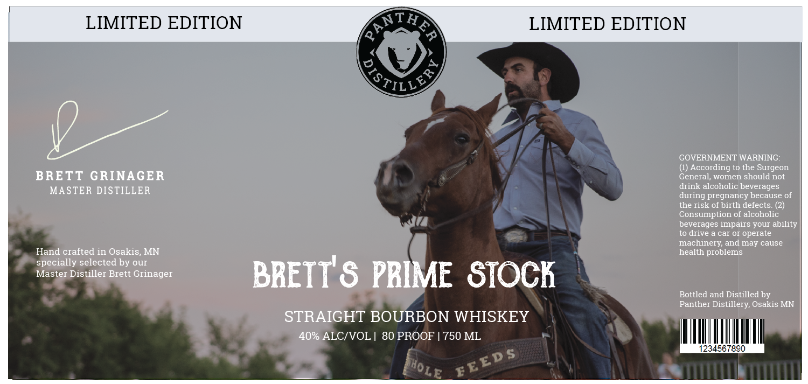

# TTB COLA Label Images - TTBID 26138001000630

**Brand Name:** PANTHER DISTILLERY

**Fanciful Name:** BRETT'S PRIME STOCK STRAIGHT BOURBON WHISKEY

**Issue Date:** 05/21/2026

**Origin Code:** 27

**Product Class/Type:** 101

**Source:** [TTB Public COLA Registry](https://ttbonline.gov/colasonline/viewColaDetails.do?action=publicFormDisplay&ttbid=26138001000630)

## Label Images

### Label 1

## Extracted Label Text

*Text extracted via OCR - may contain errors*

**Detected Proof:** 80

### Label 1

LIMITED EDITION
ntiA
LIMITED EDITION
GOVERNMENT WARNING:
According to the Surgeon
BRETT GRINAGER
General, women should not
MASTER DISTILLER
drink alcoholic beverages
during pregnancy because of
the risk of birth defects_
Consumption of alcoholic
beverages impairs your ability
to drive a car O1 operate
machinery;
may cause
Hand crafted in Osakis;
MN
health problems
specially selected by our
Master Distiller Brett Grinager
BRETT' & PRIME STOCh
Bottled and Distilled by
Panther Distillery; Osakis MN
STRAIGHT BOURBON WHISKEY
40% ALCIVOL
80 PROOF
750 ML
1234567890
Qu)
and
BEED $
(HOLe
