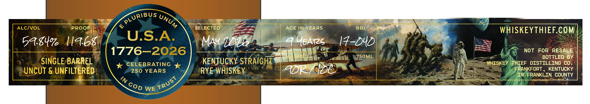
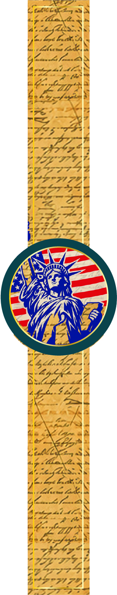
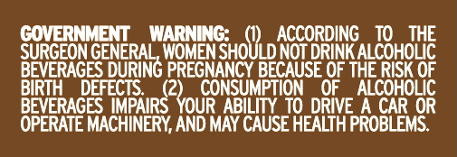

# TTB COLA Label Images - TTBID 26138001000714

**Brand Name:** WHISKEY THIEF DISTILLING CO.

**Issue Date:** 05/22/2026

**Origin Code:** 22

**Product Class/Type:** 102

**Source:** [TTB Public COLA Registry](https://ttbonline.gov/colasonline/viewColaDetails.do?action=publicFormDisplay&ttbid=26138001000714)

## Label Images

### Front Label

### Label 3

### Label 4

## Extracted Label Text

*Text extracted via OCR - may contain errors*

### Front Label

ALCIvoL
PROOF
&
SELECTED
AGE IN YEARS
BBL
WHISKEYTHIEF.COM
5A.8417
Ia68
U.S.A
MAuLlb
AUEATS
17-DYDi
1776-2026
NOT
FOR
RESALE
Mashi-
750ML
BOTTLED BY
SINGLE BARREL
CELEBRATING
KENTUCKY STRAIGHT
WHISKEY
THIEF
DISTILLING CO .
UNCUT & UNFILTERED
250 YEARS
RYE WHISKEY
ADP / cDC
FRANKFORT , KENTUCKY
IN
FRANKLIN COUNTY
'1
WE
PLURIBUs
UNUM
TRUsT
GOD

### Label 3

Ceeiceae2a SS
p< <5
Pie SNS
G Land one
@ he Lond Co
ie
j 5 Fash
Pagel
is Tyr
yg 7b
ee
| AEWA RAL ENE
aa
azz 7254
2g oe
roe 4
ae eee
Fact |
bzeheny,
B54
AS ~<ctTh
SIE
We’
Wf PON
WANS
] y\\ er
eezaarl
4 pal, 4
aay
f 5SoKh
ABA.
ee 38
eR
at SNS
eee
Apa AA
aN
Z Ae,
per contlreeah
eta 3s
betes =a)
S- ate]
5 ida
epee
CUATAT7E
Is S755

### Label 4

COVERNMENT
WARNLNG:
ACCORDING
TO
THE
SURGEON GENERAL, WOMEN SHOULD NOT DRINKALCOHOLIC
BEVERAGES
PREGNANCY BECAUSE OF THE RISK OF
BIRTH
DEFECTS
S2youonsuliptioo
OF
ALCOHOLIC
BEVERAGES IMPAIRS
ABILITY TO DRIVE
A CAR OR
OPERATE MACHINERY AND MAY CAUSE HEALTH PROBLEMS:
DURING
