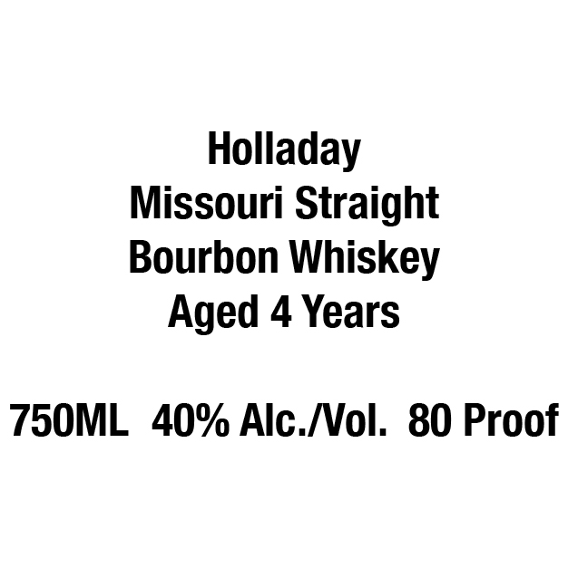
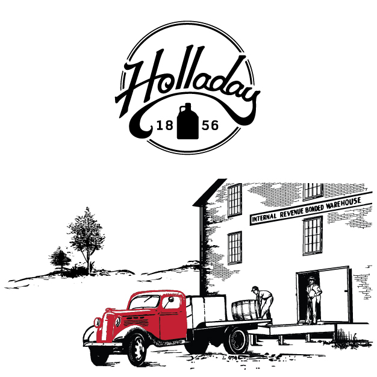
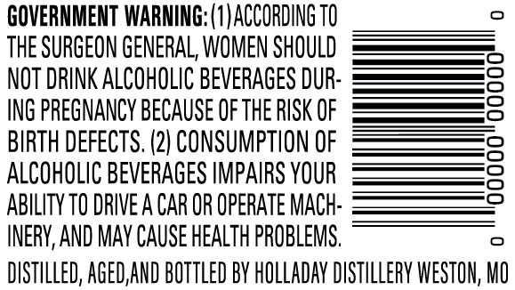

# TTB COLA Label Images - TTBID 26139001000042

**Brand Name:** HOLLADAY

**Issue Date:** 05/26/2026

**Origin Code:** 29

**Product Class/Type:** 101

**Source:** [TTB Public COLA Registry](https://ttbonline.gov/colasonline/viewColaDetails.do?action=publicFormDisplay&ttbid=26139001000042)

## Label Images

### Front Label

### Label 1

### Label 3

### Label 4

## Extracted Label Text

*Text extracted via OCR - may contain errors*

*1 image(s) excluded: text did not meet readability threshold*

**Detected Proof:** 80
**Detected Age:** 4 Years

### Front Label

Holladay
Missouri Straight
Bourbon Whiskey
Aged 4 Years
750ML
409 Alc [ol: 80 Proof

### Label 3

GOVERNMENT WARNING: (1)ACCORDING TO

THE SURGEON GENERAL, WOMEN SHOULD

NOT DRINK ALCOHOLIC BEVERAGES DUR

ING PREGNANCY BECAUSE OF THE RISK OF

BIRTH DEFECTS. (2) CONSUMPTION OF

ALCOHOLIC BEVERAGES IMPAIRS YOUR

ABILITY TO DRIVE A CAR OR OPERATE MACH

INERY, AND MAY CAUSE HEALTH PROBLEMS.

DISTILLED, AGED,AND BOTTLED BY HOLLADAY DISTILLERY WESTON, Wo

### Label 4

SYWIA
qaov

TWNISIYO 9581 AVGVTIOH

AGED
YEARS
