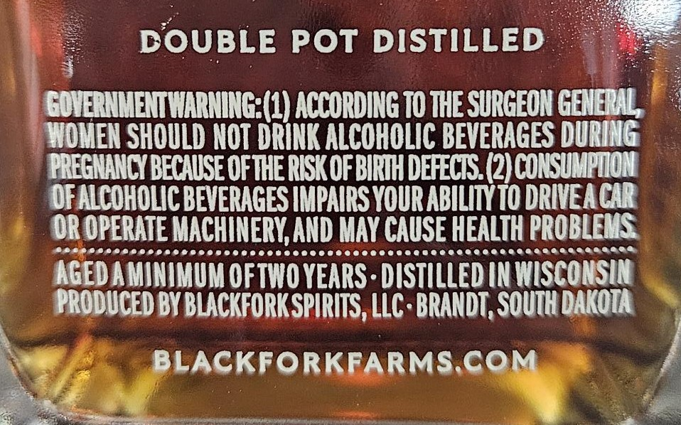
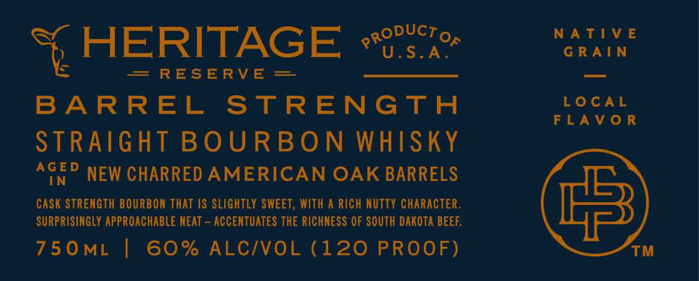
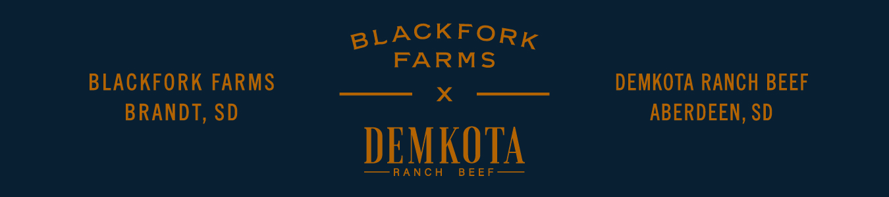

# TTB COLA Label Images - TTBID 26139001000120

**Brand Name:** BLACKFORK FARMS

**Issue Date:** 05/26/2026

**Origin Code:** 42

**Product Class/Type:** 101

**Source:** [TTB Public COLA Registry](https://ttbonline.gov/colasonline/viewColaDetails.do?action=publicFormDisplay&ttbid=26139001000120)

## Label Images

### Back Label

### Front Label

### Label 2

## Extracted Label Text

*Text extracted via OCR - may contain errors*

**Detected Proof:** 120

### Back Label

DOUBLE Pot DISTILLED
EOVERNMEMTIARNING;(4) ACCORDING TO THE SURGEON GENELAL
WOVEN SHOULD NOt DRINK ALCOHOLIC BEVERAGES DuRING
PREGMANCY BECAUSE OFTHERISKOFBIRTH DEFECIS (2)CONSUMPTON
OFALCOHOLC BEVERAGES IMPAIRS YOURABILITYTO DRIVEACAR
OROPERATE MACHINERYAND MAY CAUSE HEALTH PROBLCUS
AGEDAMINIMUM OFTWO YEARS: DISTILLED IN WISCOMSIN
PRODUCED BYBLACKFORKSPIRITS, LLC: BRANDT, SOUth DakoTA
BLACKFORKFARMSCoM

### Front Label

a4 HERITAGE #vscn

= RESERVE =—
BARREL STRENGTH

STRAIGHT BOURBON WHISKY
AGED NEW CHARRED AMERICAN OAK BARRELS

CASK STRENGTH BOURBON THAT IS SLIGHTLY SWEET, WITH A RICH NUTTY CHARACTER.
SURPRISINGLY APPROACHABLE NEAT — ACCENTUATES THE RICHNESS OF SOUTH DAKOTA BEEF.

750mt | 60% ALC/VOL (120 PROOF)

NATIVE
GRAIN

LOCAL
FLAVOR

™

### Label 2

BLACKFORK
FARMS
BLACKFORK FARMS
DEMKOTA RANCH BEEF
BRANDT, SD
ABERDEEN, SD
DEMKOTA
RANC H
B EE F
