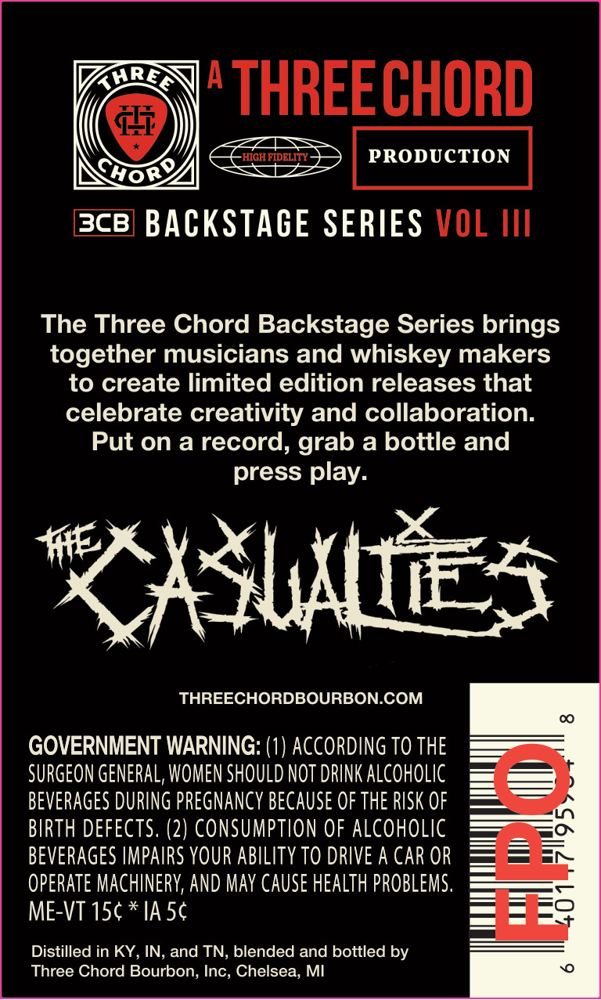
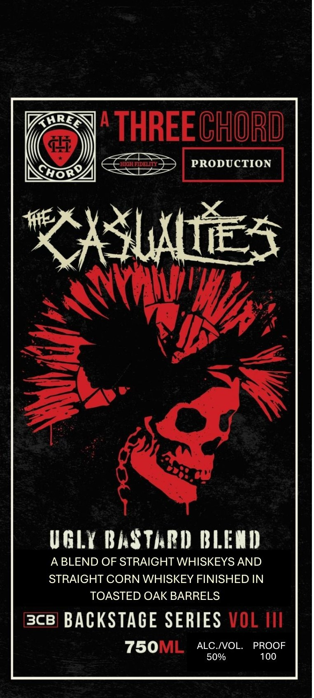

# TTB COLA Label Images - TTBID 26139001000168

**Brand Name:** THREE CHORD

**Issue Date:** 06/01/2026

**Origin Code:** 06

**Product Class/Type:** 129

**Source:** [TTB Public COLA Registry](https://ttbonline.gov/colasonline/viewColaDetails.do?action=publicFormDisplay&ttbid=26139001000168)

## Label Images

### Back Label

### Front Label

## Extracted Label Text

*Text extracted via OCR - may contain errors*

**Detected Proof:** 100

### Back Label

KHREA
0
THREECHORD
HGHFIDELITY
PRODUCTION
Hor
3c8] BACKSTAGE SERIES VOL IIl
The Three Chord Backstage Series brings
together musicians and whiskey makers
to create limited edition releases that
celebrate creativity and collaboration:
Put on a record, grab a bottle and
press play:
XXUau,
THREECHORDBOURBON.COM
0O
GOVERNMENT WARNING: (1) ACCORDING TO THE
SURGEON GeNERAL, WOMEN SHOULD NOT DRINK alcoholic
BEVERAGes DURING PREGNANCY because OF the RISK OF
BIRTH DEFECTS: (2) CONSUMPTION OF ALCoholic
BEVERAGES IMPAIRS VOUR ABILITY TO DRIVE A CAR OR
3
operate MAChINERY; AND May Cause health PROBLEMS.
ME-VT 15c * IA 5c
Distilled in KY , IN, and TN, blended and bottled by
Three Chord Bourbon; Inc, Chelsea; MI

### Front Label

A
THREE CHORD
HIGh FIDELT
PRODUCTION
Cwor%
XXSlAll,
X
UGLY BASThPD) BLEMI)
A BLEND OF STRAIGHT WHISKEYS AND
STRAIGHT CORN WHISKEY FINISHED IN
TOASTED OAK BARRELS
3CB
BACKSTAGE SERIES VOL
750ML
ALC IVOL
PROOF
50%
100
GHRL
