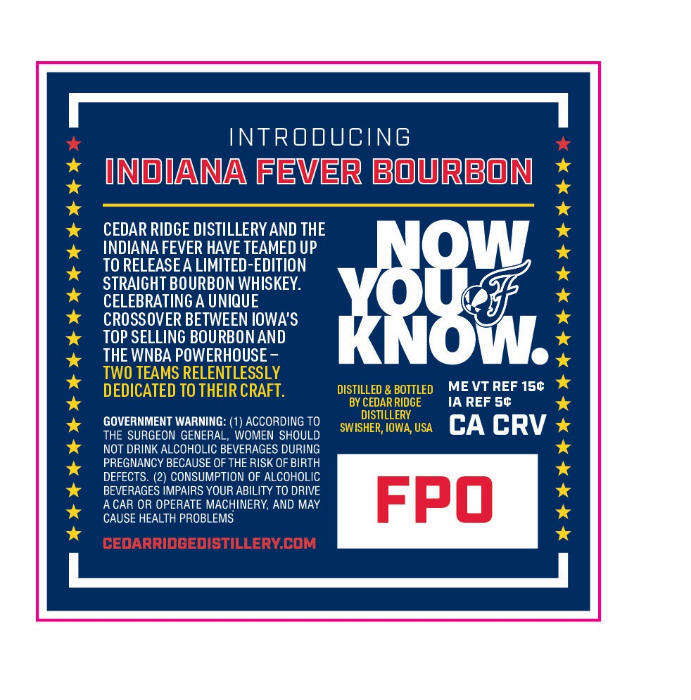
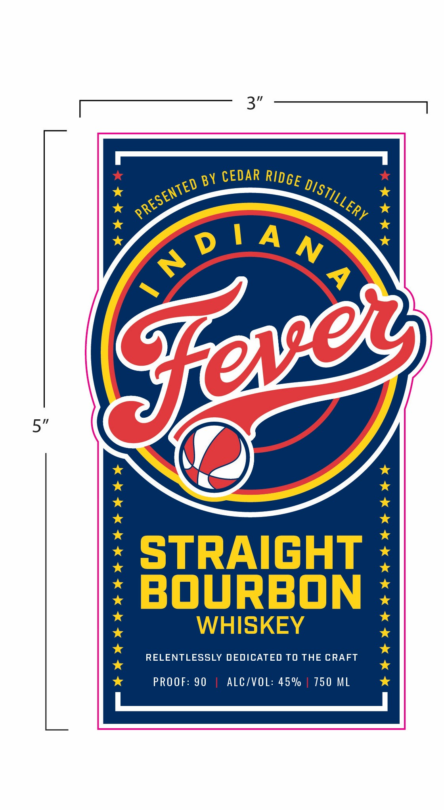

# TTB COLA Label Images - TTBID 26139001000174

**Brand Name:** CEDAR RIDGE DISTILLERY

**Issue Date:** 05/27/2026

**Origin Code:** 20

**Product Class/Type:** 101

**Source:** [TTB Public COLA Registry](https://ttbonline.gov/colasonline/viewColaDetails.do?action=publicFormDisplay&ttbid=26139001000174)

## Label Images

### Back Label

### Front Label

## Extracted Label Text

*Text extracted via OCR - may contain errors*

**Detected Proof:** 90

### Back Label

INTRODUCING
INiANA Fever bourbon
CEDAR RIDGE DISTILLERY AND THE
INDIANA FEVER HAVE TEAMED UP
TO RELEASEA LIMITED-EDITION
STRAIGHT BOURBON WHISKEY.
CROSBOVER BETUVEEUFOWAS
Kk8W
TOP SELLING BOURBON AND
THE WNBA POWERHOUSE
TWO TEAMS RELENTLESSLY
DEDICATED TO THEIR CRAFT.
DISTILLED & BOTTLED
ME VT REF 150
BY CEDAR RIDGE
IA REF S0
GOVERNMENT WARNING: (1) ACCORDING TO
SWISHETH LOFFX USA
CA CRV
THE SURGEON GENERAL, WOMEN SHOULD
NOT DRINK ALCOHOLIC BEVERAGES DURING
PREGNANCY BECAUSE OF THE RISK OF BIRTH
DEFECTS: (2) CONSUMPTION OF ALCOHOLIC
BEVERAGES IMPAIRS YOUR ABILITY TO DRIVE
A CAR OR OPERATE MACHINERY, AND MAY
FPO
CAUSE HEALTH PROBLEMS
cedArridgedISTILLERYCOM

### Front Label

3"
BY CEDAR
Jo!AN)
5"
STRAIGHT
BOuRBON
WHISKEY
RELENTLESSLY DEDICATED TO THE CRAFT
PROOF: 90
ALCIVOL: 45%
750 ML
RIDGE
PRESENTED
DISTILLERY
Seveg
