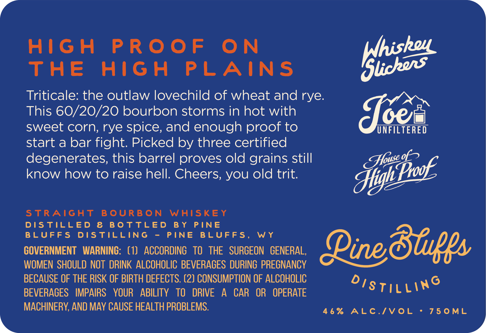
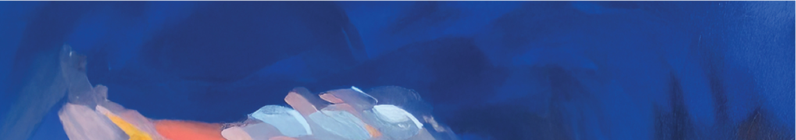

# TTB COLA Label Images - TTBID 26139001000234

**Brand Name:** PINE BLUFFS DISTILLING

**Fanciful Name:** NO COUNTRY FOR OLD TRITS TRITICALE BOURBON

**Issue Date:** 05/27/2026

**Origin Code:** 49

**Product Class/Type:** 101

**Source:** [TTB Public COLA Registry](https://ttbonline.gov/colasonline/viewColaDetails.do?action=publicFormDisplay&ttbid=26139001000234)

## Label Images

### Front Label

### Label 2

## Extracted Label Text

*Text extracted via OCR - may contain errors*

*1 image(s) excluded: text did not meet readability threshold*

### Front Label

>»

HIGH PROOF ON pishon
THE HIGH PLAINS Meo

Triticale: the outlaw lovechild of wheat and rye.
This 60/20/20 bourbon storms in hot with oes
sweet corn, rye spice, and enough proof to UNFILTERED
start a bar fight. Picked by three certified

degenerates, this barrel proves old grains still sigh bok
7 if

know how to raise hell. Cheers, you old trit. Stiyt:

STRAIGHT BOURBON WHISKEY

DISTILLED & BOTTLED BY PINE
BLUFFS DISTILLING - PINE BLUFFS, WY . a>
GOVERNMENT WARNING: (1) ACCORDING TO THE SURGEON GENERAL, Dine Stuffs
WOMEN SHOULD NOT DRINK ALCOHOLIC BEVERAGES DURING PREGNANCY

BECAUSE OF THE RISK OF BIRTH DEFECTS. (2) CONSUMPTION OF ALCOHOLIC Oo; S SKS)
BEVERAGES IMPAIRS YOUR ABILITY TO DRIVE A CAR OR OPERATE TILL

MACHINERY, AND MAY CAUSE HEALTH PROBLEMS. etn Cl cue ect
