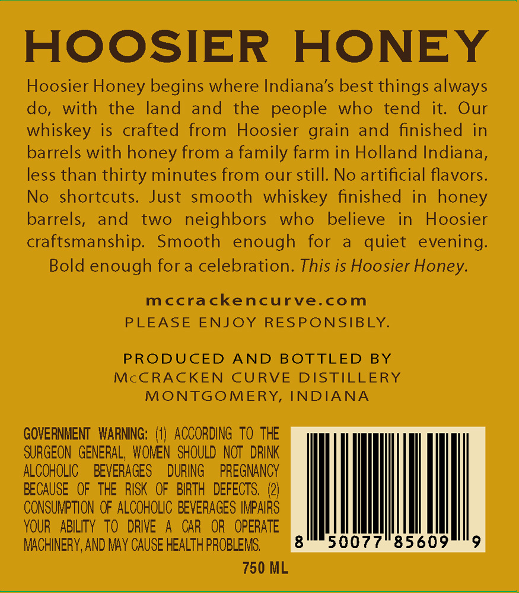
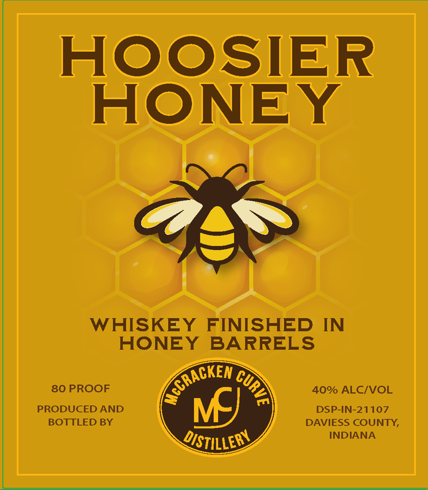

# TTB COLA Label Images - TTBID 26139001000247

**Brand Name:** HOOSIER HONEY

**Issue Date:** 06/17/2026

**Origin Code:** 19

**Product Class/Type:** 140

**Source:** [TTB Public COLA Registry](https://ttbonline.gov/colasonline/viewColaDetails.do?action=publicFormDisplay&ttbid=26139001000247)

## Label Images

### Back Label

### Front Label

## Extracted Label Text

*Text extracted via OCR - may contain errors*

**Detected Proof:** 80

### Back Label

HOOSIER HONEY

Hoosier Honey begins where Indiana's best things always

do, with the land and the people who tend it. Our

whiskey is crafted from Hoosier grain and finished in

barrels with honey from a family farm in Holland Indiana,

less than thirty minutes from our still. No artificial flavors.

No shortcuts. Just smooth whiskey finished in honey

barrels, and two neighbors who believe in Hoosier

craftsmanship. Smooth enough for a quiet evening.

Bold enough fora celebration. This is Hoosier Honey.

mccrackencurve.com

PLEASE ENJOY RESPONSIBLY.

PRODUCED AND BOTTLED BY

McCRACKEN CURVE DISTILLERY

MONTGOMERY, INDIANA

GOVERNMENT WARNING: (1) ACCORDING TO THE

ALCOHOLIC BEVERAGES DURING PREGNANCY

SURGEON GENERAL, WONEN SHOULD NOT DRINK

BECAUSE OF THE RISK OF BIRTH DEFECTS. (2)

CONSUMPTION OF ALCOHOLIC BEVERAGES IMPAIRS

YOUR ABILITY TO DRIVE A CAR OR OPERATE

MACHINERY, AND MAY CAUSE HEALTH PROBLEMS.

750 ML

### Front Label

HOOsIER
HONEY
3
WHISKEY
FINISHED IN
HONEY
BARRELS
80 PROOF
40% ALCIVOL
PRODUCED AND
DSP-IN-21107
BOTTLED BY
DAVIESS COUNTY,
DISTILLERV
INDIANA
(crACKEN
9
MJ
