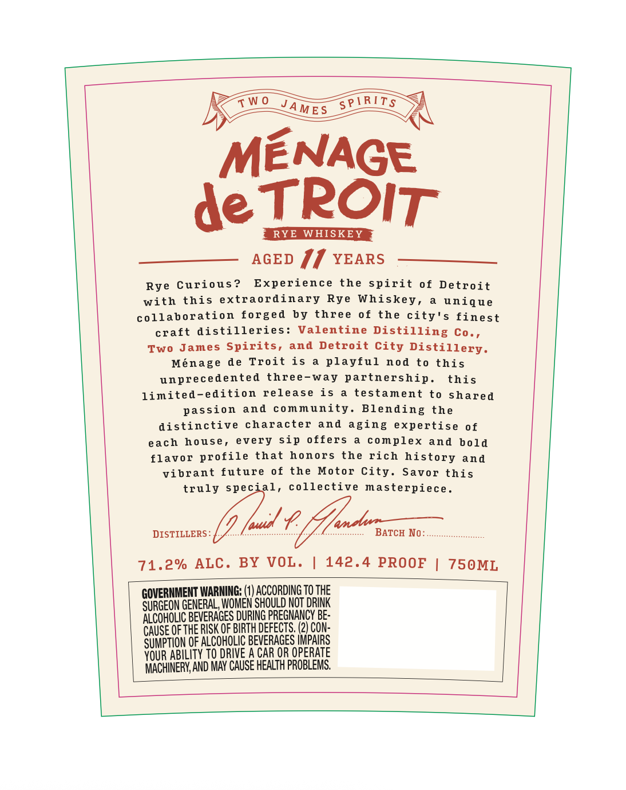
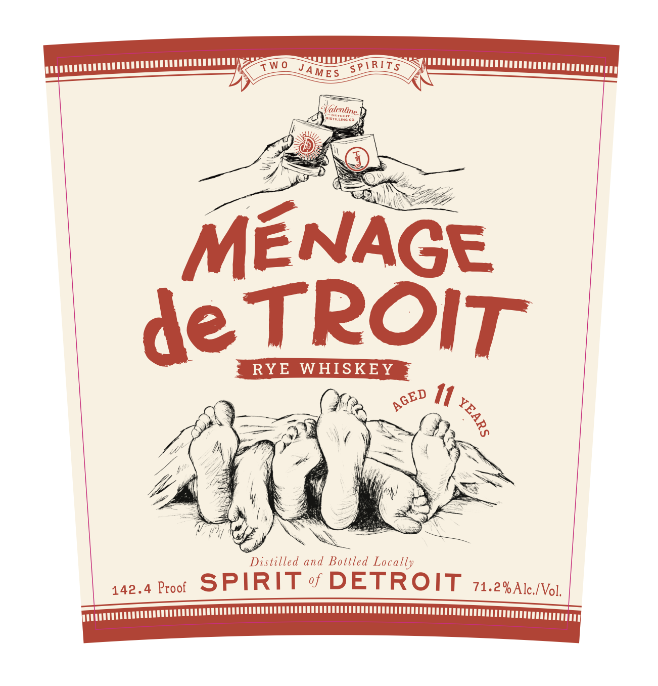
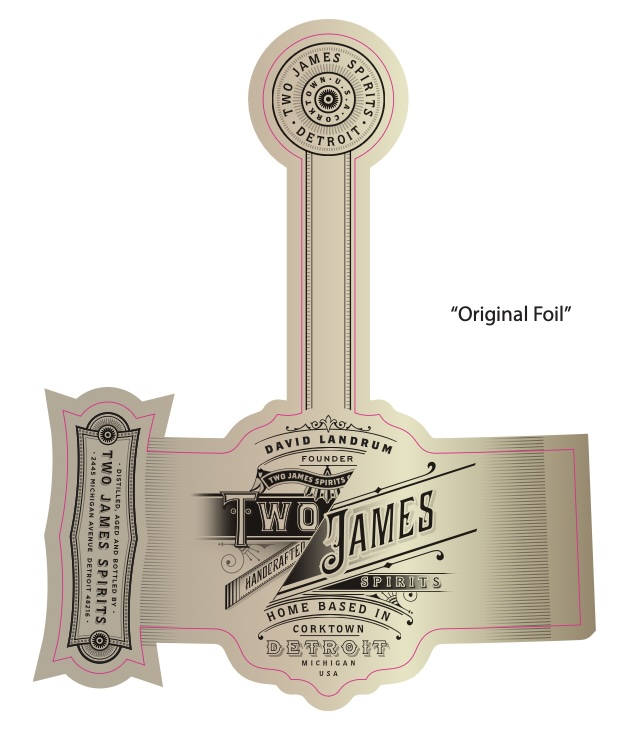

# TTB COLA Label Images - TTBID 26139001000268

**Brand Name:** TWO JAMES SPIRITS

**Fanciful Name:** MENAGE DE TROIT

**Issue Date:** 06/12/2026

**Origin Code:** 06

**Product Class/Type:** 142

**Source:** [TTB Public COLA Registry](https://ttbonline.gov/colasonline/viewColaDetails.do?action=publicFormDisplay&ttbid=26139001000268)

## Label Images

### Back Label

### Label 1

### Label 3

## Extracted Label Text

*Text extracted via OCR - may contain errors*

**Detected Proof:** 142.4

### Back Label

S PTRITS
MENAGE
de TPOIT
RYE
WHISKEY
AGED I1 YEARS
Rye
Curious ?
Experience
the spirit
of Detroit
with
this extraordinary
Rye Whiskey ,
unique
collaboration forged by three of
the city's finest
craft distilleries:
Valentine Distilling
Two James Spirits,
and Detroit City Distillery.
Menage
de
Troit is
playful
nod
to
this
unprecedented
three-way partnership.
this
limited-edition
release is
testament to shared
passion
and
community. Blending the
distinctive
character
and aging
expertise
0 f
each
house ,
every
sip
offers
complex
and
bold
flavor profile that honors
the rich history and
vibr
future
of
the
Motor City. Savor this
truly special,
collective masterpiece_
DISTILLERS
BATCH No:
71.2%
ALC _
BY
VOL .
142.4 PROOF
750ML
GOVERNMENT WARNING: (2) ACCORDING TQ THE
SURGEON GENERAL, WOMEN SHOULD NQT DRINK
ALCOHOLIC BEVERAGES DURING PREGNANCY BE:
CAUSE OFTHE RISK QF BIRTH DEFECTS: (2) CQN:
SUMPTioN OF ALCOHOLIC BEVERAGES IMPAIRS
YOUR ABILITY TO DRIWE A CAR OR OPERATE
MACHINERY, AND MAy CAUSE HEALTH PROBLEMS
T W 0
JAMES
Co . !
ant

### Label 1

"SPTRIT $
Distilling
MENAGE
de TPOIT
RYE
WHISKEY
11
Distilled and Bottled Locally
142.4 Proof
SPIRIT
DETROIT
71.2% Alc /Vol,
TW 0
JAMES
Fiftcntine
AGED
1

### Label 3

aaa

i

ONY

LSS

“Original Foil”

ge.

ARS.

LAND

NDER

Ruy

L

Ane

5

|

D Ty

‘TOWN

Ne

Our

mw iewican

te
