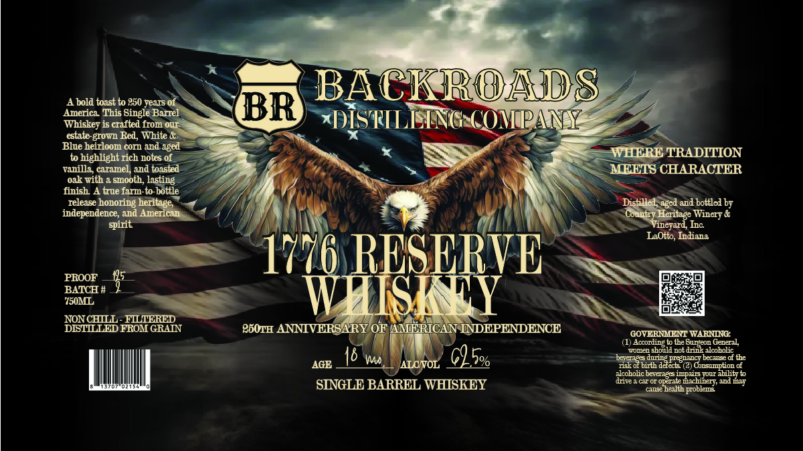

# TTB COLA Label Images - TTBID 26139001000287

**Brand Name:** BACKROADS DISTILLING COMPANY

**Fanciful Name:** 1776 RESERVE

**Issue Date:** 06/09/2026

**Origin Code:** 19

**Product Class/Type:** 140

**Source:** [TTB Public COLA Registry](https://ttbonline.gov/colasonline/viewColaDetails.do?action=publicFormDisplay&ttbid=26139001000287)

## Label Images

### Label 1

## Extracted Label Text

*Text extracted via OCR - may contain errors*

**Detected Proof:** 177

### Label 1

bold toast to 250 vears of
BACKROADS
Americ:
This Single Barrel
BR
TVhiske
crafted from our
DISTILLNNG (OMPANY
estate
T
White
Blue hei
m corn and aged
to hie
ight rich notes of
WHERE TRADITION
vanilla
ramel and toasted
MEETS CHARACTER
oak
smooth; lasting
finish
true farm-to bottle
Teleas
honoring
Distille
and bottled by
indeper
lence, and American
spirit
Terard,
LaOlto, Indiana
PROOF
1776 RESERVE
BATCH #
Y50ML
WHISHY
NONCHLLL - FLLIERED
DISTLLLED FROM GRAIN
P60TH ANNIVERSARY OF AMERICANINDEPENDENCE
GOVERIMENT WARNING
Accolding _
General
TL-u
should not drin
lcoholic
6
62 5%
beverages,
Wnninio
Pregnanct
nse of the
AGE
riakof birth delects (?) Cons
Ioton
alcoholic beverages
ImT3
abilityto
SINGLE BARREL WHISKEY
dive
C O1 Opirate machin
1nd my
cause health probl
Red,
berilage,
4,nged
Icritage
Winery _
Inc
he Burtton
