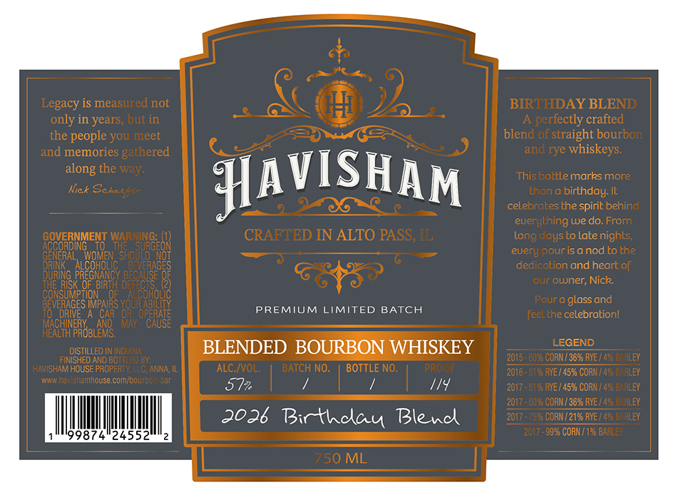

# TTB COLA Label Images - TTBID 26139001000328

**Brand Name:** HAVISHAM

**Fanciful Name:** BIRTHDAY BLEND

**Issue Date:** 05/26/2026

**Origin Code:** 04

**Product Class/Type:** 131

**Source:** [TTB Public COLA Registry](https://ttbonline.gov/colasonline/viewColaDetails.do?action=publicFormDisplay&ttbid=26139001000328)

## Label Images

### Front Label

## Extracted Label Text

*Text extracted via OCR - may contain errors*

### Front Label

Legacy is measured not
BIRTHDAY BLEND
only in years; but in
A perfectly crafted
the people you meet
blend of straight bourbon
and memories gathered
and rye whiskeys:
the way:
Nick
HAVISHAM
This bottle marks more
thana
birthday: It
celebratesthe spirit behind
euerything we do.From
WrNGLO
CRAFTED IN ALTO PASS; IL
Long daysto late nights;
E83
GyotQen'
SHOULD
euery pour isanod to the
ALCOHOLIC
dedicalion and heart of
DURI
our ouner; Nick:
CONSUMP
Pour
glass and
IMPAIRS YOUR ABIL
CAR
OPERATE
PREMIUM
LIMITED BATCH
feel the celebrationl
Bareaar
MaV
CAUSE
DISTILLED ININDIANA
BLENDED BOURBON WHISKEY
LEGEND
FINISHED AND BOTTLED BY:
2015 = €0% CORN/3SXRYE /496 BARLEY
HAVISHAM HOUSE PROPERTY; LLC; ANNA; IL
ALC IVOL;
BATCH NO.
BOTTLE NO:
PRONF
2016 = 5198 RYE / 457 CORN / 493 BARLEY
Mm
havishamhouse comjbcurbon-bar
572
114
2017 - 5198 AYE / 4598 CORN / 496 BaALEY
2017 =€078 CORN / 36% RYE / 496 BARLEY
2026 Birthclau Blencl
2017 = 7570 CORN /2196 RYE [498 BarLEY
99874"24552
2017 -9976 CORN / 195 BARLEY
750 ML
along
Schatd er
