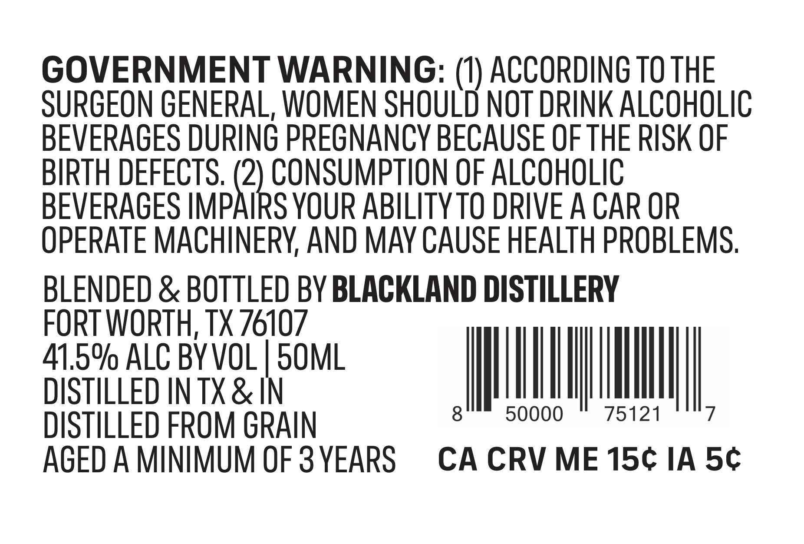
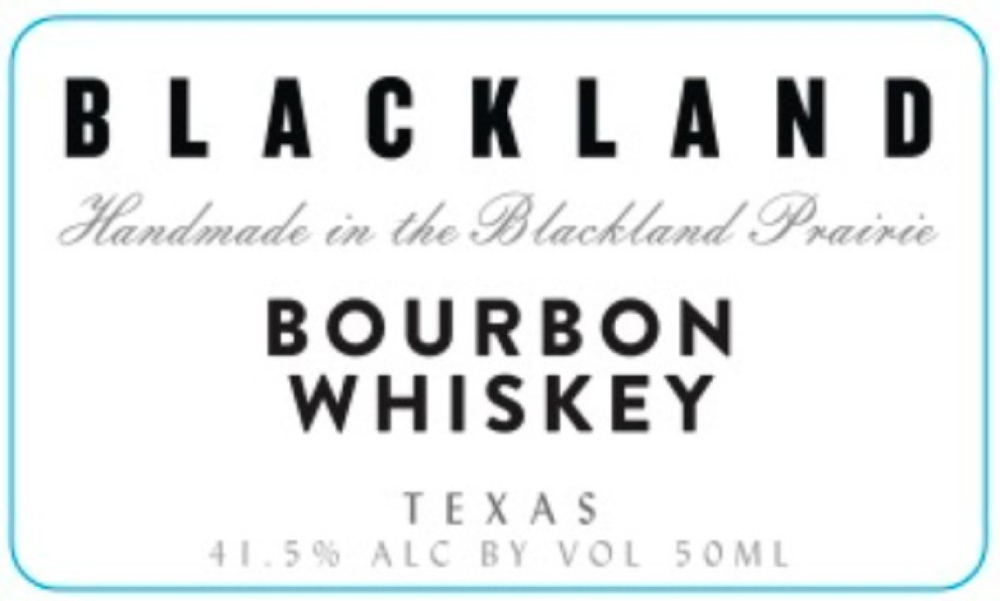

# TTB COLA Label Images - TTBID 26139001000615

**Brand Name:** BLACKLAND

**Issue Date:** 05/28/2026

**Origin Code:** 44

**Product Class/Type:** 141

**Source:** [TTB Public COLA Registry](https://ttbonline.gov/colasonline/viewColaDetails.do?action=publicFormDisplay&ttbid=26139001000615)

## Label Images

### Back Label

### Front Label

## Extracted Label Text

*Text extracted via OCR - may contain errors*

*1 image(s) excluded: text did not meet readability threshold*

**Detected Age:** 3 Years

### Back Label

GOVERNMENT WARNING: (U) ACCORDING TO THE
SURGEON GENERAL, WOMEN SHOULD NOT DRINK ALCOHOLIC
BEVERAGES DURING PREGNAnCY BECAUSE OF THE RISK OF
BIRTH DEFECTS. (2) CONSUMPTION OF ALCOHOLIC
BEVERAGES IMPAIRS YOUR ABILITY TO DRIVE A CAR OR
OPERATE MACHINERY AND MAY CAUSE HEALTH PROBLEMS,
BLENDED & BOTTLED BY BLACKLAND DISTILLERY
FORT WORTH; TX 76107
41.59 ALC BYVOL
5OML
DISTILLED IN TX & IN
8
50000
75121
7
DISTILLED FROM GRAIN
AGED A MINIMUM OF 3 YEARS
CA CRV ME 15c IA 5c
