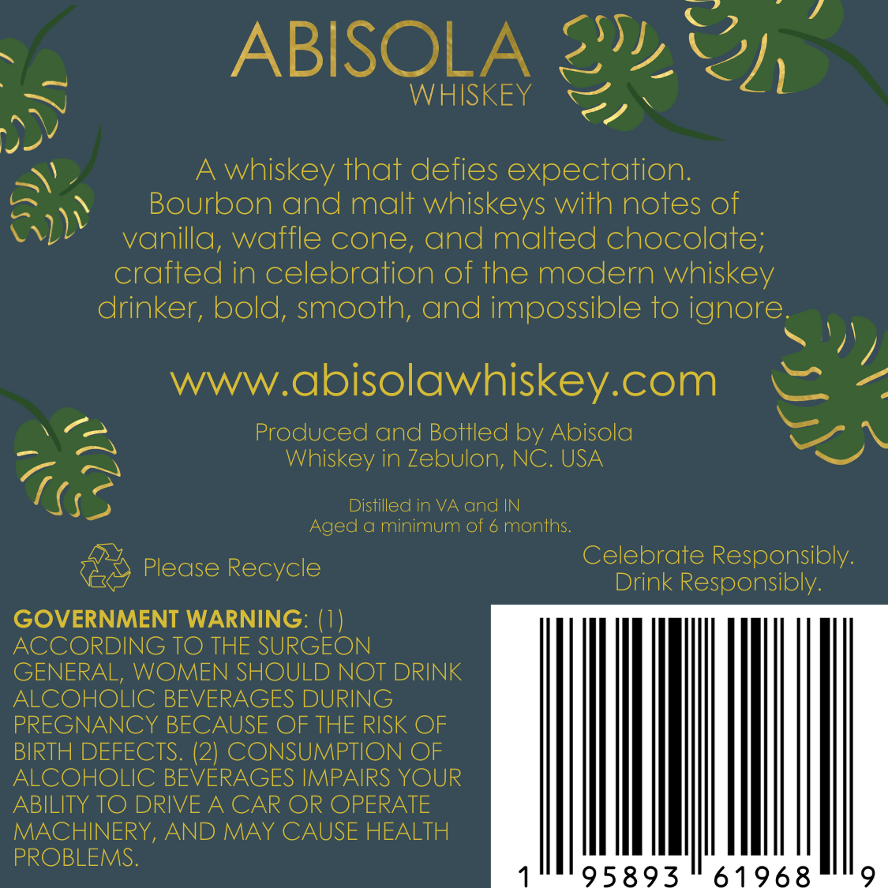
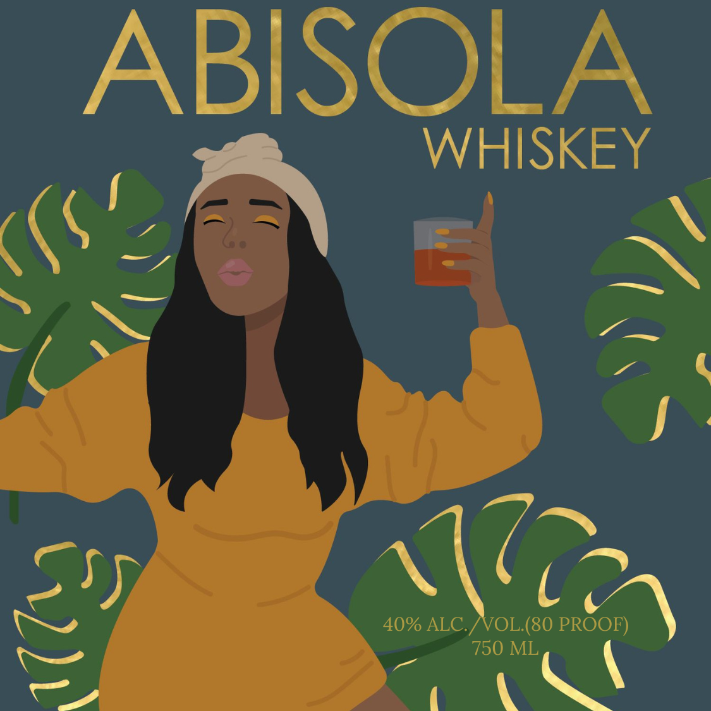

# TTB COLA Label Images - TTBID 26139001000652

**Brand Name:** ABISOLA WHISKEY

**Issue Date:** 05/27/2026

**Origin Code:** 35

**Product Class/Type:** 140

**Source:** [TTB Public COLA Registry](https://ttbonline.gov/colasonline/viewColaDetails.do?action=publicFormDisplay&ttbid=26139001000652)

## Label Images

### Back Label

### Front Label

## Extracted Label Text

*Text extracted via OCR - may contain errors*

*1 image(s) excluded: text did not meet readability threshold*

### Back Label

~»

ABISOLA 27!

WHISKEY

2 Cy

AN

wey

\)

~

\

A whiskey that defies expectation

Bourbon and malt whiskeys with notes of

CAL

vanilla, waffle cone, and malted chocolate

crafted in celebration of the modern whiskey

drinker, bold, smooth, and impossible to ignore.

a

www.abisolawhiskey.com &

¢

YS

Produced and Bottled by Abisola

aN

Whiskey in Zebulon, NC. USA

Gs

Distilled in VA and IN

Aged a minimum of 6 months

Celebrate Responsibly

~) Please Recycle

Drink Responsibly

GOVERNMENT WARNING: (1)

ACCORDING TO THE SURGEON

GENERAL, WOMEN SHOULD NOT DRINK

ALCOHOLIC BEVERAGES DURING

PREGNANCY BECAUSE OF THE RISK OF

BIRTH DEFECTS. (2) CONSUMPTION OF

ALCOHOLIC BEVERAGES IMPAIRS YOUR

ABILITY TO DRIVE A CAR OR OPERATE

MACHINERY, AND MAY CAUSE HEALTH

iil

PROBLEMS

95893 "61968
