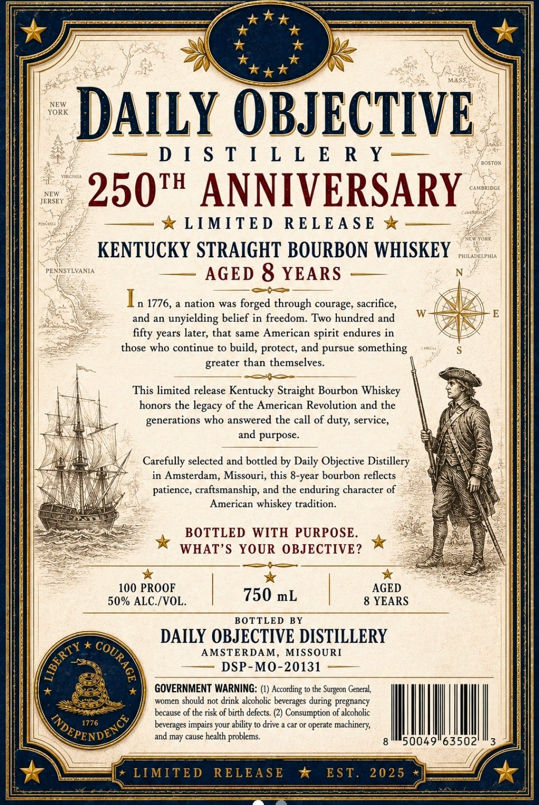
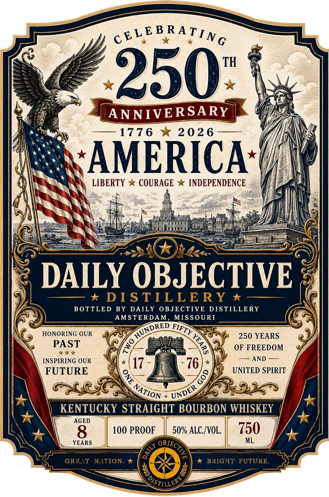

# TTB COLA Label Images - TTBID 26139001000654

**Brand Name:** KENTUCKY STRAIGHT BOURBON WHISKEY

**Issue Date:** 05/27/2026

**Origin Code:** 29

**Product Class/Type:** 101

**Source:** [TTB Public COLA Registry](https://ttbonline.gov/colasonline/viewColaDetails.do?action=publicFormDisplay&ttbid=26139001000654)

## Label Images

### Back Label

### Front Label

## Extracted Label Text

*Text extracted via OCR - may contain errors*

**Detected Proof:** 100
**Detected Age:** 8 Years

### Back Label

NEW
YORK
DAILY OBJECTIVE
D [ S T [ L L E R Y
ROSTON
JERSEY
250t ANNIVERSARY
AMBRIDGE
LIMITED
REL EA S €
TORR
KENTUCKY STRAIGHT BOURBON WHISKEY
PHILADELPHLA
PENNSYLVANIA
AGED 8 YEARS
1776,
nation was forged through courage, sacrifice,
and an
unyielding belief in freedom: Two hundred and
fifty years later; that same American spirit endures in
those who continue to build, protect, and pursue something
greater than themselves.
This limited release Kentucky Straight Bourbon
honors the
legacy of the American Revolution and the
generations who answered the call of
service,
and purpose:
Carefully selected and bottled by Daily Objective Distillery
in Amsterdam, Missouri, this 8-year bourbon reflects
patience; craftsmanship, and the enduring character of
American whiskey tradition.
BOTTLED WITH PURPOSE.
WHAT'S YOUR OBJECTIVE?
100 PROOF
AGED
50% ALC /VOL.
750 mL
8 YEARS
BOTTLED BY
DAILY OBJECTIVE DISTILLERY
AMSTERDAM, MISSOURI
DSP-MO-20131
GOVERNMENT WARNING: (4) According to the
General
women
should not drink alcoholic
beverages
pregnancy
because of the risk of birth defects: (2) Consumption of alcoholic
NOEPENDE %/
1776
beverages impairs your ability to drive
car Or
operate machinery;
and may cause health
'problems.
50049"63502
LIMITED
RELEASE
EST.
2025
Whiskey
duty,
COURAGE
0
Surgeon'
during

### Front Label

cELEB RATIN G
TH
250
ANNIVER SARY
177 6
20 2 6
AMERICA
LIBERTY
COURAGE
INDEPENDENCE
DAILY OBJECTIVE
DIS TILLE RY
BOTTLED
BY DAILY OBJECTIVE
DISTILLERY
AMSTERDAM,
MISSOURI
HONORING OUR
250 YEARS
PAST
OF FREEDOM
INSPIRING OUR
AND
17
76
FUTURE
UNITED SPIRIT
KENTUCKY STRAIGHT BOURBON WHISKEY
AGED
8
100 PROOF
50% ALC /VOL
750
YEARS
ML
GREAT
NATION.
BRIGHT
FUTURE_
OSTILLER )
HUNDRED'
FIFTY
1
8
9
8
NATION
UNDER
GPECTIVA
AILY
