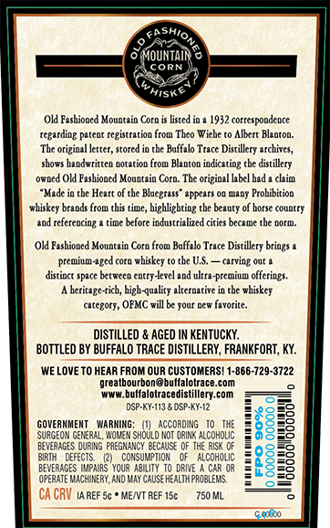
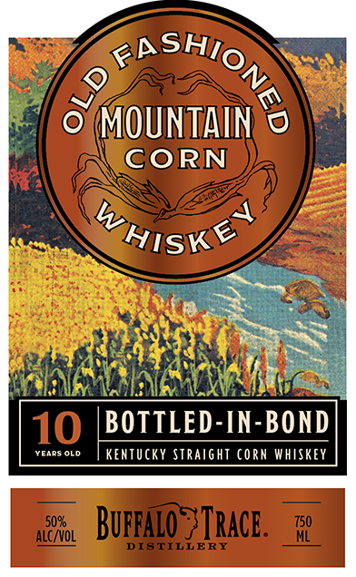
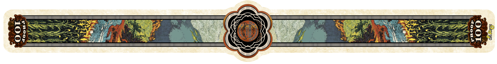

# TTB COLA Label Images - TTBID 26139001000666

**Brand Name:** OLD FASHIONED MOUNTAIN CORN

**Issue Date:** 05/28/2026

**Origin Code:** 22

**Product Class/Type:** 113

**Source:** [TTB Public COLA Registry](https://ttbonline.gov/colasonline/viewColaDetails.do?action=publicFormDisplay&ttbid=26139001000666)

## Label Images

### Back Label

### Front Label

### Label 3

## Extracted Label Text

*Text extracted via OCR - may contain errors*

*1 image(s) excluded: text did not meet readability threshold*

### Back Label

Kashio
93
'MOUNTAIR
CorN
Hiske
Old Fashioned Mountaio Coro
listed io =
1932 correspondence
regarding
DI(cOC
registration
Theo Wiche
Alberc Blaoton:
The origiazl letter, stored
tbe Baffalo Trace Distillery erchives,
shovs haadwrittea aotatioo from Blaaton iadicating the distillery
0TLCd
OH Fashioned Mouatain Cora: The orizinal labcl bad
chin
"Mede ja the Hcart of the Blaegrass" -ppcars 0n (aDj Prohibition
whiskey brands from this timc, highlighring the beauty of horse country
J0d rcferenciog
time kxfore industrizlized citics becate the 4orm
Old Fasbioned Mountain Coro from Baffalo Trace Distillery briogs
premium-aged cora Fhiskey
the US
carving Out @
distinct space bet#cca cntry-Ierel aed ultra-premium offerings:
heritage-rich, hizh-quality alternative
tbe whiskey
catezorj , OFMC will be your pew favorite.
DISTILLeD _
AGED IN KENTUCKY:
BOTTLEd BY BUFFALO TRACE DISTILLERY, FRANKFORT, KY:
We LovE TO HEAR FROM OUR CUSTOMERS! 1-866-729-3722
grealbourbon@bullalolrace.com
WwW
bulfalolracedistillery com
DSP-KY-113
OSP KY-12
GOVERMMENT
WA RWIMG;
According
I
SURGEOM GeMeraL, WomeM Should NoI [3ink alcoholIc
EveaaGES DURIng PREGMANCY BeCaSE Qf THE RKS' @F
BIRTH
DEFECTS
consuWPTIOM
alcoholIC
2
1
BEWeRAGES MMpairs YouR
DRIVE
CAR 0r
OPERATE Wacm nERY; ANd Way CAuSE HEALTHPROBLEMS,
Ca CRV IA REF 5c =
MENT REF 15c
750 ML
ceb
8
(tol

### Front Label

0
MOUNTAIN
CORN
4
10
BOTTLED-IN-BOND
VcARS OLd
Kentucky Straight Corn Whiskey
5096
Buppaio ? IRacE.
750
alc /VOL
DISTILLERY
<RSHIONG
2
WHISK<
