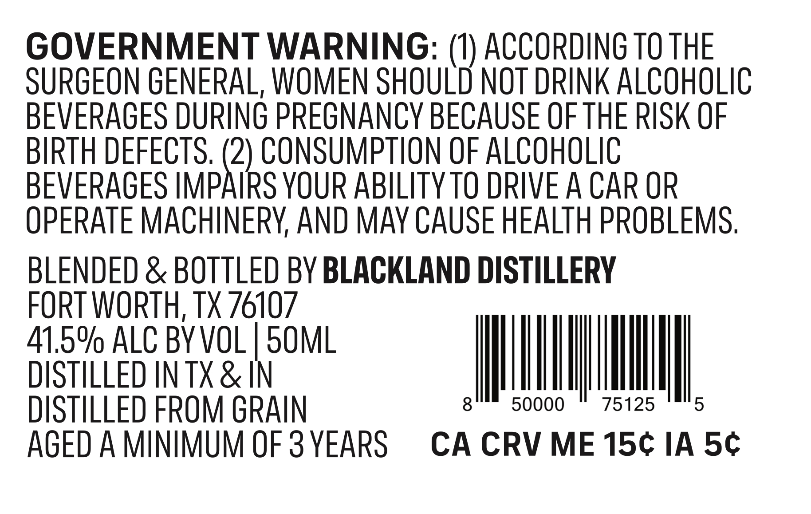
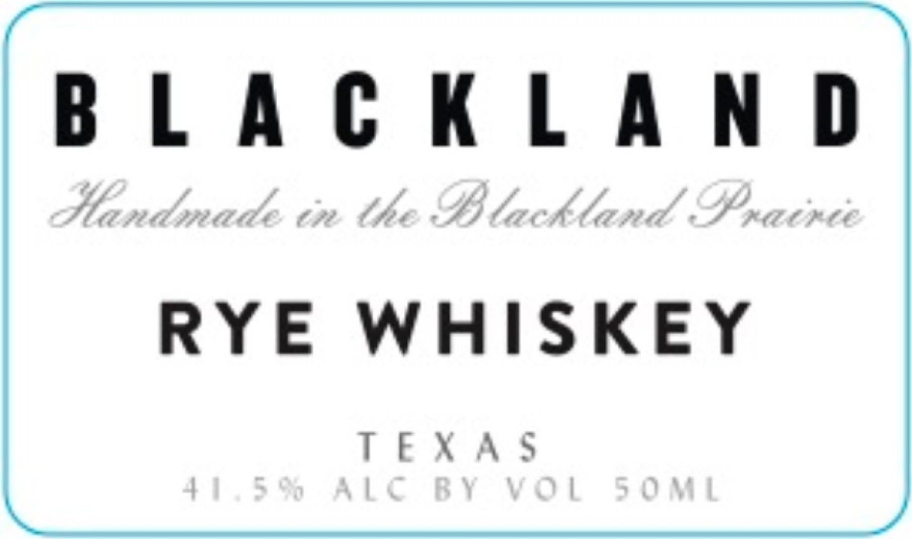

# TTB COLA Label Images - TTBID 26139001000667

**Brand Name:** BLACKLAND

**Issue Date:** 05/28/2026

**Origin Code:** 44

**Product Class/Type:** 142

**Source:** [TTB Public COLA Registry](https://ttbonline.gov/colasonline/viewColaDetails.do?action=publicFormDisplay&ttbid=26139001000667)

## Label Images

### Back Label

### Front Label

## Extracted Label Text

*Text extracted via OCR - may contain errors*

**Detected Proof:** 83
**Detected Age:** 3 Years

### Back Label

GOVERNMENT WARNING: (1) ACCORDING TO THE
SURGEON GENERAL, WOMEN SHOULD NOT DRINK ALCOHOLIC
BEVERAGES DURING PREGNANCY BECAUSE OF THE RISK OF
BIRTH DEFECTS. (2) CONSUMPTION OF ALCOHOLIC
BEVERAGES IMPAIRS YOUR ABILITYTO DRIVE A CAR OR
OPERATE MACHINERV AND MAY CAUSE HEALTH PROBLEMS.
BLENDED & BOTTLED BY BLACKLAND DISTILLERY
FORT WORTH, tX 76107
41.5% ALC BYVOL
5OML
DISTILLED IN TX & IN
DISTILLED FROM GRAIN
8
50000
75125
5
AGED A MINIMUM OF 3 YEARS
CA CRV ME 15c IA 5c

### Front Label

hehe taht

RYE WHISKEY

TEXAS
