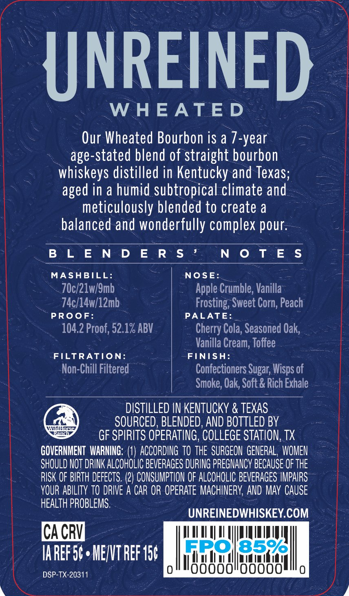
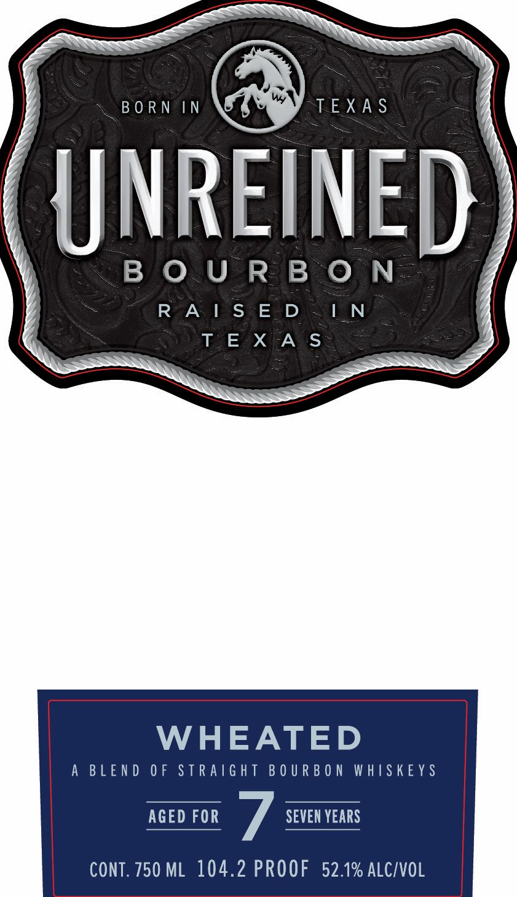
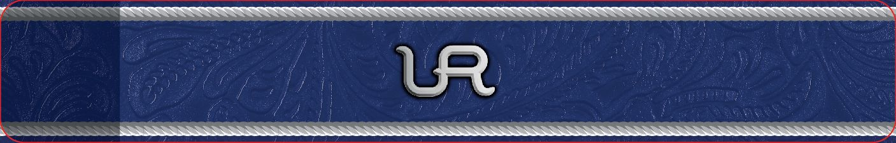

# TTB COLA Label Images - TTBID 26139001000668

**Brand Name:** UNREINED

**Fanciful Name:** WHEATED

**Issue Date:** 05/27/2026

**Origin Code:** 44

**Product Class/Type:** 121

**Source:** [TTB Public COLA Registry](https://ttbonline.gov/colasonline/viewColaDetails.do?action=publicFormDisplay&ttbid=26139001000668)

## Label Images

### Back Label

### Front Label

### Label 3

## Extracted Label Text

*Text extracted via OCR - may contain errors*

*1 image(s) excluded: text did not meet readability threshold*

**Detected Proof:** 104.2

### Back Label

ay

~UNREINED

WHEATED-

Our Wheated Bourbon is a 7- -year

age-stated blend of straight bourbon

whiskeys distilled in Kentucky and Texas;

aged in a humid subtropical climate and

meticulously blended to create a

balanced and wonderfully complex pour

BLENDER S’

ME chai

MASHBILL

NOSE:

70c/21w/9mb

Apple Crumble, Vanilla

74c/14w/12mb-

Frosting, Sweet Corn, Peach

PROOF:

PALATE:

10. 2 Proof, 52. 1x ABV

Cherry Cola, Seasoned Oak

Vanilla Cream, Toffee

FILTRATION

FINISH:

Non-Chill Filtered

Confectioners Sugar, Wisps of

Smoke, Oak, Soft: & Rich Exhale

DISTILLED IN KENTUCKY & TEXAS.

SOURCED, BLENDED, AND BOTTLED BY

@

GF SPIRITS OPERATING, COLLEGE STATION, TX

SHOULD NOT DRINK ALCOHOLIC BEVERAGES DURING PREGNANCY BECAUSE OF THE

GOVERNMENT WARNING: (1) ACCORDING TO THE SURGEON GENERAL, WOMEN

YOUR ABILITY TO DRIVE A CAR oR OPERATE MACHINERY, AND MAY CAUSE

RISK OF BIRTH DEFECTS. (2) CONSUMPTION OF ALCOHOLIC BEVERAGES IMPAIRS

HEALTH PROBLEMS.

UNREINEDWHISKEY. com

mung

DIM IED GY

lk it se a

oll

uta

nisin (hia

DSP-TX-20311

00000

00000

Le

hk,

### Front Label

< BORN IN TEXAS

{JNREINE

BOURBON

R=A 1 S°E-D IN
Ta EeXTAYS

WHEATED

A BLEND OF STRAIGHT BOURBON WHISKEYS

AGED FOR 7 SEVEN YEARS

CONT. 750 ML 104.2 PROOF 52.1% ALC/VOL
