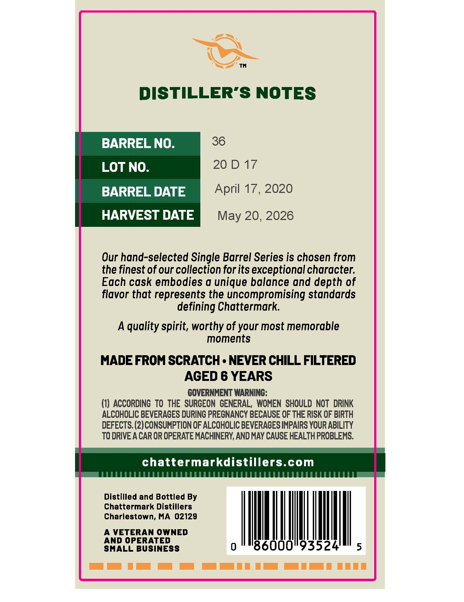
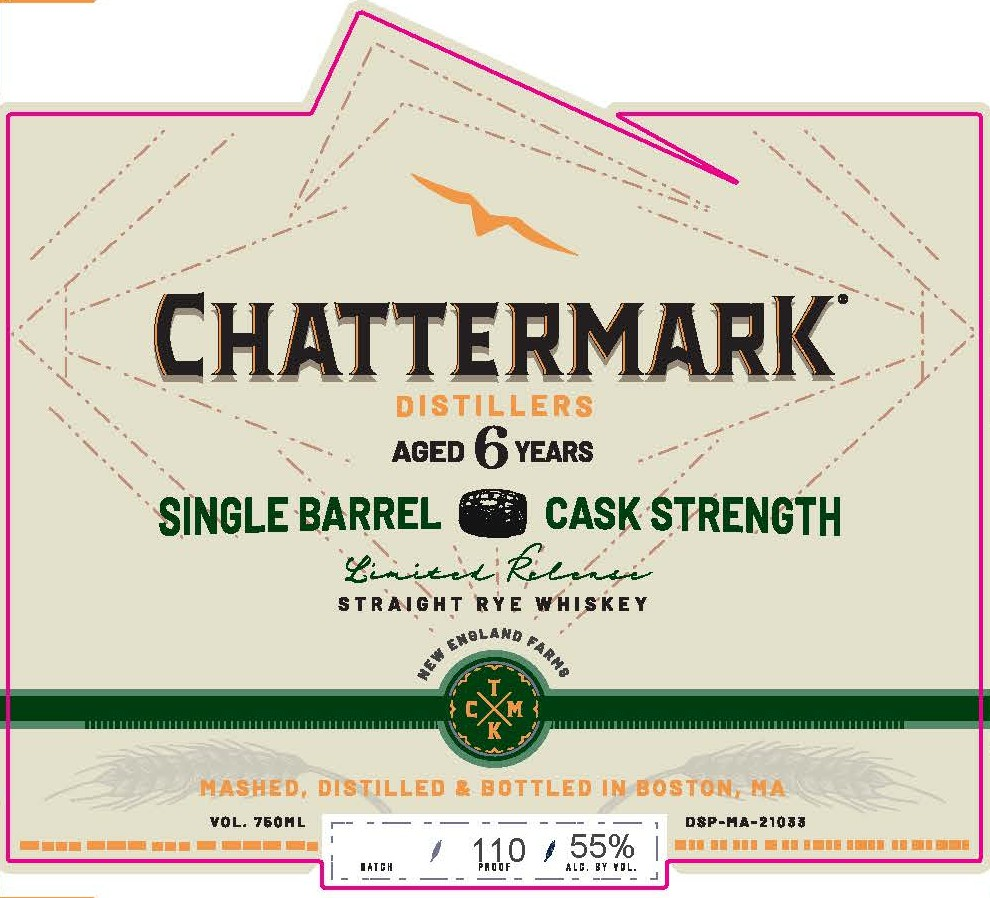

# TTB COLA Label Images - TTBID 26140001000164

**Brand Name:** CHATTERMARK DISTILLERS

**Fanciful Name:** AGED 6 YEARS CASK STRENGTH STRAIGHT RYE WHISKEY

**Issue Date:** 05/27/2026

**Origin Code:** 26

**Product Class/Type:** 102

**Source:** [TTB Public COLA Registry](https://ttbonline.gov/colasonline/viewColaDetails.do?action=publicFormDisplay&ttbid=26140001000164)

## Label Images

### Back Label

### Front Label

## Extracted Label Text

*Text extracted via OCR - may contain errors*

**Detected Proof:** 110
**Detected Age:** 6 Years

### Back Label

DISTILLER’S NOTES

BARREL NO.

36

LOT NO.

ZOD 17

BARREL DATE

April 17, 2020

HARVEST DATE

May 20, 2026

Our hand-selected Single Barrel Series is chosen from

the finest of our collection for its exceptional character.

Each cask embodies a unique balance and depth of

flavor that represents the uncompromising standards

defining Chattermark.

A quality spirit, worthy of your most memorable

moments

MADE FROM SCRATCH - NEVER CHILL FILTERED

AGED 6 YEARS

GOVERNMENT WARNING:

(1) ACCORDING TO THE SURGEON GENERAL, WOMEN SHOULD NOT DRINK

ALCOHOLIC BEVERAGES DURING PREGNANCY BECAUSE OF THE RISK OF BIRTH

DEFECTS. (2) CONSUMPTION OF ALCGHOLIC BEVERAGES IMPAIRS YOUR ABILITY

TO DRIVE A CAR OR OPERATE MACHINERY, AND MAY CAUSE HEALTH PROBLEMS.

chattermarkdistillers.com

Distilled and Bottled By

Chattermark Distillers

Charlestown, MA 02129

A VETERAN OWNED

AND OPERATED

SMALL BUSINESS

AOI

ee ee

### Front Label

CHATTERMARK
DISTILLERS
AGED
6 YEARS
SINGLE BARREL
CASK STRENGTH
Yiiilel rev
StraiGHT
RYE
WAISKEY
T
cXM
K
MASHED, DISTILLEd
BOTTLED Im bostom; MA
VOL: 760ML
DSP-MA-21088
IAICH
11,0
#LC
55%
BY fPL
Enbland
FaRHB
