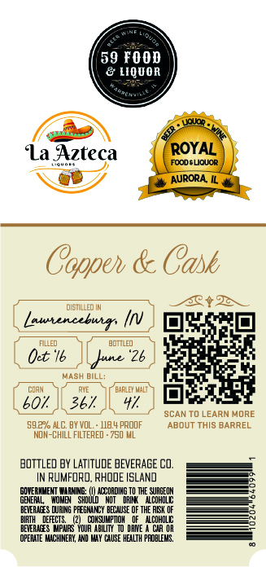
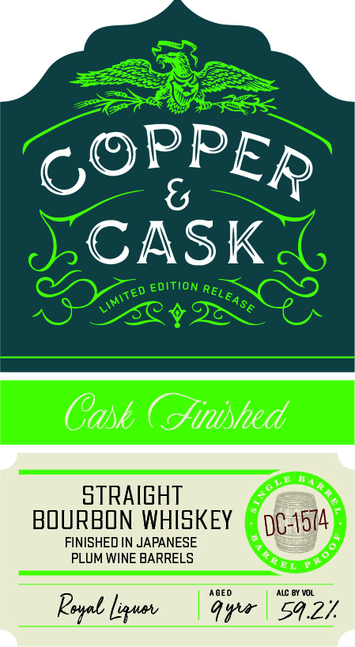

# TTB COLA Label Images - TTBID 26140001000202

**Brand Name:** COPPER & CASK

**Fanciful Name:** CASK FINISHED

**Issue Date:** 05/27/2026

**Origin Code:** 40

**Product Class/Type:** 101

**Source:** [TTB Public COLA Registry](https://ttbonline.gov/colasonline/viewColaDetails.do?action=publicFormDisplay&ttbid=26140001000202)

## Label Images

### Back Label

### Front Label

### Label 3

## Extracted Label Text

*Text extracted via OCR - may contain errors*

*1 image(s) excluded: text did not meet readability threshold*

### Back Label

59 FOOD
& LIQUOR
nt
La Azteca
ROYAL
FOODE LJQUOR
AURORA IL
Coppe & Cask
72
dibmlled IN
Lautencebutr;
DX3
FALED
BDTTLED
Oet "16
All
"26
MaSH BILL:
Cwan
DAFLEX Malt `
b0r
367
SCANTO LEARN MORE
59,22/ ALC; BY VoL
48,4 pROOF
ABOUT ThIS BARREL
NOM-ChILL FILTERED . 750 ML
BOTTLED BY LatItude BEVERAGE CO,
RUMFORD, RHODE ISLAND
GQHERMMENI
IIRNING;
HCCORdIHG IQ THE SURGEON
GENEPAL
HOMEX   ShHOULD > NOT
DRIN
ILCOHOLC
BEVERXES [URING PFEGNKCY BECAUSE OF THE REK OF
BIRTH
DEFECTS
QhsuMpTOH
ILCOHOLC
BEERAGS  MPTRS' YOUR ABILITY
DRIE
CR OR
OPERATE MUCHINERK; UND W4Y CAUSE HEALTH PPOBLEMS,
Kowos
JpUpieii

### Front Label

COPPER
CASK
EDITION
Cask ( inished
STRAIGHT
BOURBON WHISKEY
DC-1574
FINISHED IN JAPANESE
PLUM WINE BARRELS
AGED
AlC By VOL
Rsal Lyuv
Qxu
Sq.7
RELEASE
LIMITED
