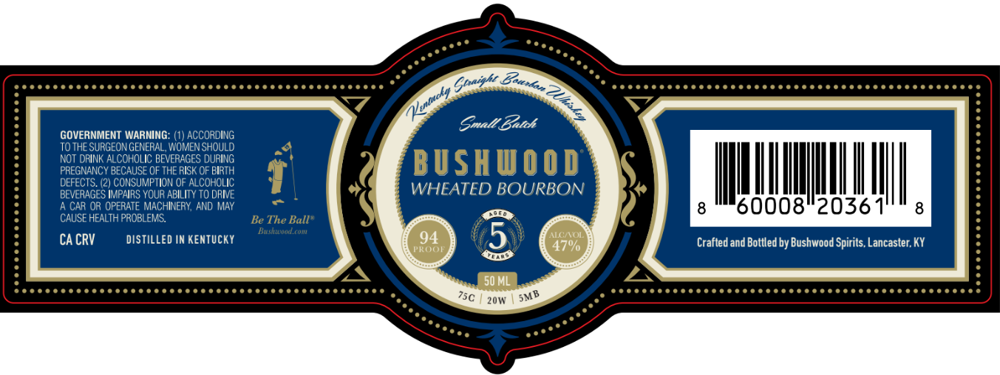

# TTB COLA Label Images - TTBID 26140001000236

**Brand Name:** BUSHWOOD

**Issue Date:** 06/08/2026

**Origin Code:** 22

**Product Class/Type:** 101

**Source:** [TTB Public COLA Registry](https://ttbonline.gov/colasonline/viewColaDetails.do?action=publicFormDisplay&ttbid=26140001000236)

## Label Images

### Label 1

## Extracted Label Text

*Text extracted via OCR - may contain errors*

**Detected Proof:** 94

### Label 1

Small Batch
GOVERNMENT WARNING:
ACCORDING
TO THE SURGEON GENERAL, WOMEN SHOULD
NOT DRINK ALCOHOLIC BEVERAGES DURING
BUSHUOOD
PREGNANCY BECAUSE OF THE RISK OF BIRTH
DEFECTS.
2) CONSUMPTION OF ALCOHOLIC
BEVERAGES IMPAIRS YOUR ABILITY TO DRIVE
WHEATED BOURBON
CAR OR OPERATE MACHINERY
MAY
60008"2036
8
CAUSE HEALTH PROBLEMS
Be The Ball"
BusknbeAtou
CA CRV
DISTILLED IN KENTUCKY
94
5
HLCOL
47%
Crafted and Bottled by Bushwood Spirits. Lancaster;
RouF
50 ML
75C
20m
Beunk _
Gtaighc
QUhistrg
Kentacky
AND
SMB
