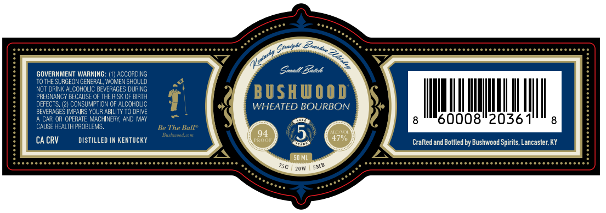

# TTB COLA Label Images - TTBID 26140001000245

**Brand Name:** BUSHWOOD

**Issue Date:** 05/30/2026

**Origin Code:** 22

**Product Class/Type:** 101

**Source:** [TTB Public COLA Registry](https://ttbonline.gov/colasonline/viewColaDetails.do?action=publicFormDisplay&ttbid=26140001000245)

## Label Images

### Label 1

## Extracted Label Text

*Text extracted via OCR - may contain errors*

### Label 1

GOVERNMENT WARNING
ACCORDING
Small Betch
TO THE SURGEON GENERAL, WOMEN SHOULD
NOT DRINK ALCOHOLIC BEVERAGES DURING
BUSHUOOD
PREGNANCY BECAUSE OF THE RISK OF BIRTH
DEFECTS, (2) CONSUMPTION OF ALCOHOLIC
WHEATED BOURBON
BEVERAGES IMPAIRS YOIR ABILITY TO DRIVE
CAR OR OPLRATE MACHINERY
MAY
60008"2036
CAUSE HEALTH PROBLEMS_
Be The Ball"
U
Bytd Oudstunu
CA CRV
DISTILLED IN KENTUCKY
4700
Crafted and Bottled by Bushwood Spirits, Lancaster,KY
50 ML
75C
20W
BkZ
Soh
Mratasty
AND
SMB
