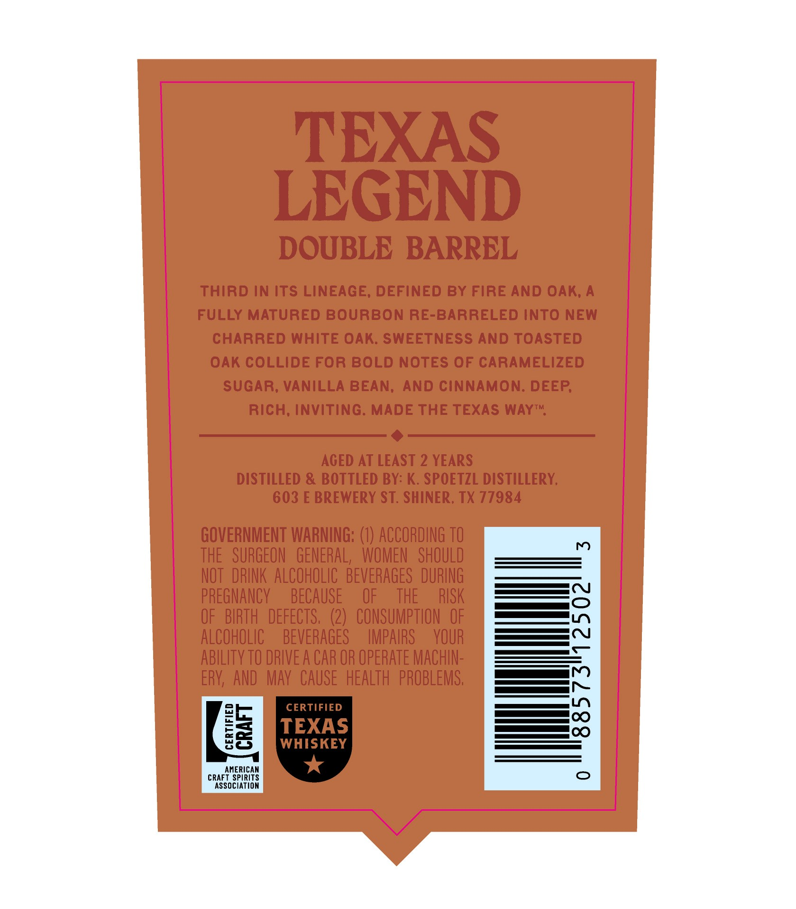
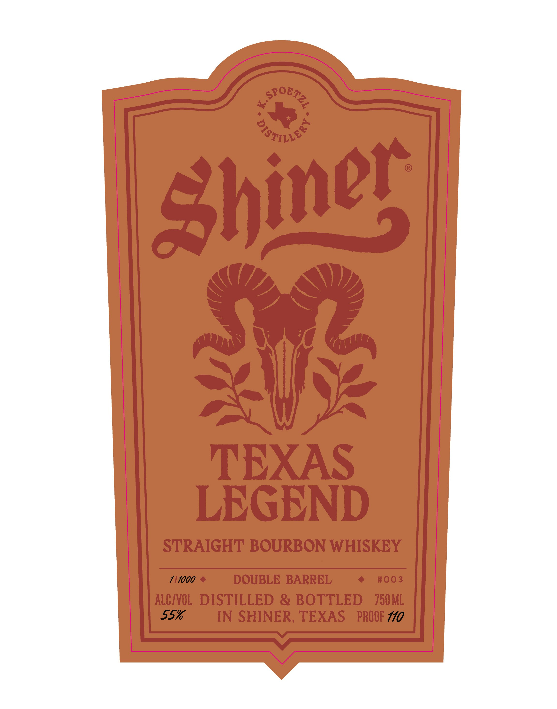

# TTB COLA Label Images - TTBID 26140001000295

**Brand Name:** SHINER

**Issue Date:** 05/27/2026

**Origin Code:** 44

**Product Class/Type:** 101

**Source:** [TTB Public COLA Registry](https://ttbonline.gov/colasonline/viewColaDetails.do?action=publicFormDisplay&ttbid=26140001000295)

## Label Images

### Back Label

### Front Label

## Extracted Label Text

*Text extracted via OCR - may contain errors*

**Detected Proof:** 110
**Detected Age:** 2 Years

### Back Label

TEXAS
LEGEND
DOUBLE BARREL
Third in Its LINEAGE; DEFINED BY FIRE AND OAK; A
FULLY MATURED bourbon RE-BARRELED InTO NEW
CHARRED WHITE OAK: SWEETNESS AND TOASTED
OAK COLLIDE For BOLD NOTES OF CARAMELIZED
SUGAR; VANILLA BEAN;
And cinnamon: DEEP
rich; inviting: MADE THE TEXAS WAYTM
ACED AT LEAST 2 YEARS
DISTILLED & BOTTLED BY: K. SPOETZL DISTILLERY;
603 E BREWERY ST. SHINER, TX 77984
GOVERNMENT WARNING: (0) ACCORDING TO
m
THE   SURGEON   GENERAL;   WOMEN   SHOULD
NOT  DRINK ALCOHOLIC  BeveRAGES   DURING
PREGNANCY
BECAUSE
OF
THE
RISK
OF   BIRTH   defects;  (2)   CONSUMPTION  OF
ALCOHOLIC
BEVERAGES
IMPAIRS
YOUR
ablLITy TO DRIVE A CAR OR OPERATE MACHIN-
1
ERV,   AND   Mav CAUSE   HEALTH  PROBLEMS,
F
CERTIFIED
1
7
TEXAS
8
WHISKEY
AMERICAM
CRAFT SPIRITS
Associatiom

### Front Label

4
971L6s
TEXAS
LEGEND
STRAIGHT BOURBON WHISKEY
111000
DOUBLE BARREL
#003
ALCIVOL   DISTILLED & BOTTLED
750 ML
55%
IN SHINER, TEXAS
PROOF /10
eSoBTez
Shiner
