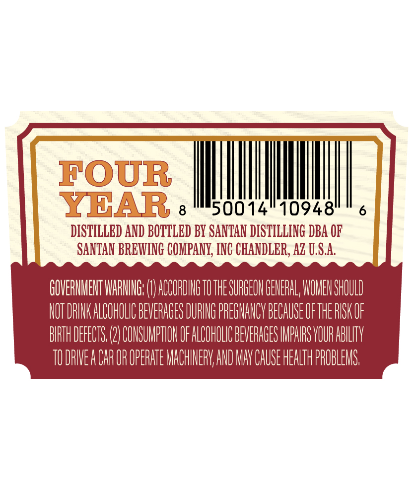
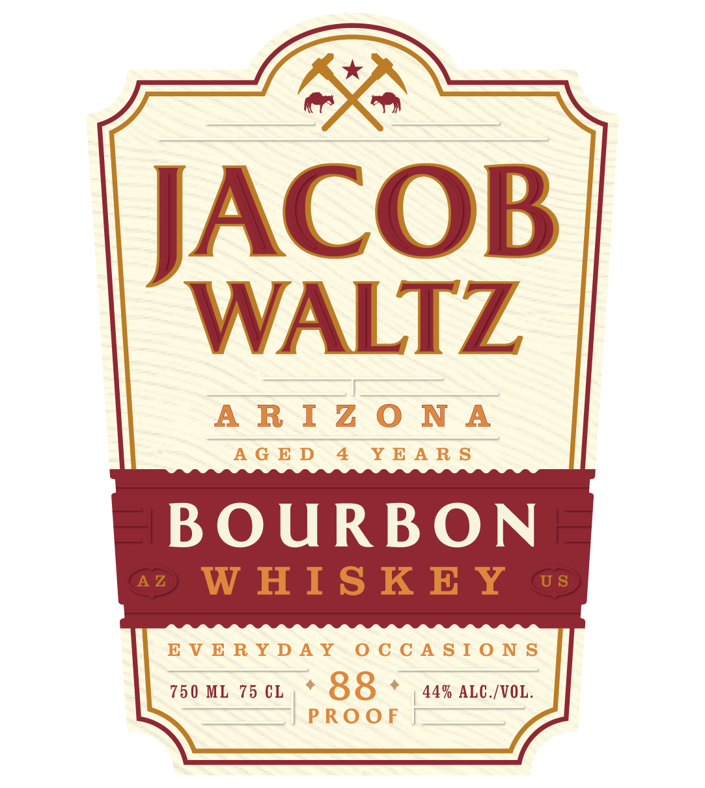

# TTB COLA Label Images - TTBID 26140001000363

**Brand Name:** JACOB WALTZ

**Fanciful Name:** BOURBON WHISKEY AGED 4 YEARS

**Issue Date:** 05/27/2026

**Origin Code:** 11

**Product Class/Type:** 141

**Source:** [TTB Public COLA Registry](https://ttbonline.gov/colasonline/viewColaDetails.do?action=publicFormDisplay&ttbid=26140001000363)

## Label Images

### Back Label

### Front Label

## Extracted Label Text

*Text extracted via OCR - may contain errors*

**Detected Age:** 4 Years

### Back Label

FOUR
YBAR
8
50014"10948"
6
DISTILLED AND BOTTLED By SANTAN DISTILLING DBA OF
SANTAN BREWING COMPANY, INC CHANDLER, Az U,S.A
GOVERMMEHT WARIG: (
AGCORDIG TOTHE SURGEOH GENERAL; WOMEH SHOULD
NOT DRINK ALCOHOLIC BEVERAGES DURING PREGMANCV BECAUSE OFTHE RISK OF
BIRTH DEFECTS (2) COMSUMPTHOH OF ALCOHOLIC BEVERAGES IMPHRS VOUR ABLLTV
TU DRIVEA CAR OR OPERATE MACHINERV AND MAV CAUSE HEALTH PROBLEMS

### Front Label

SO

JACOB

WALTZ

——

ARIZONA

AGED 4 YEARS

BOURBON

EVERYDAY OCCASIONS

| PROOF |_——_
