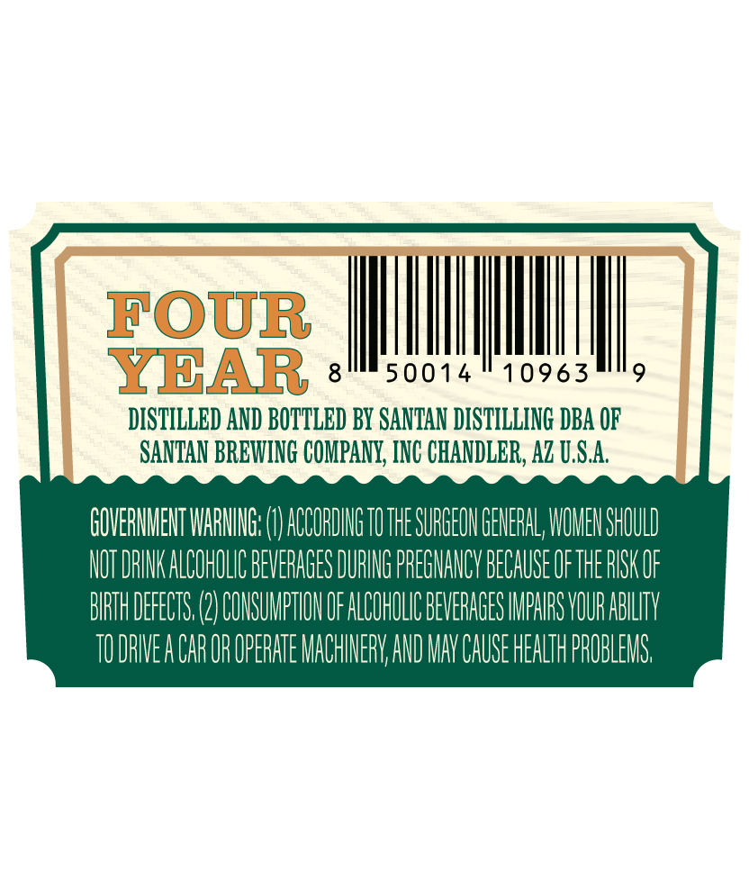
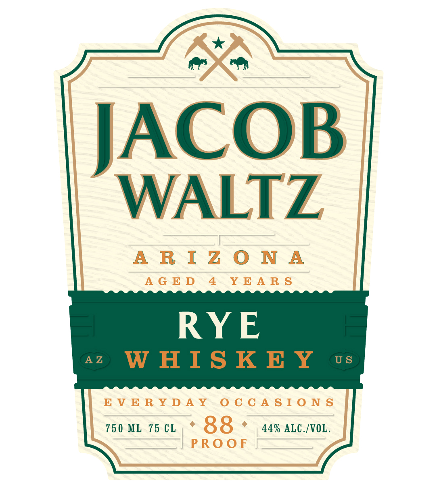

# TTB COLA Label Images - TTBID 26140001000392

**Brand Name:** JACOB WALTZ

**Fanciful Name:** RYE WHISKEY AGED 4 YEARS

**Issue Date:** 05/27/2026

**Origin Code:** 11

**Product Class/Type:** 142

**Source:** [TTB Public COLA Registry](https://ttbonline.gov/colasonline/viewColaDetails.do?action=publicFormDisplay&ttbid=26140001000392)

## Label Images

### Back Label

### Front Label

## Extracted Label Text

*Text extracted via OCR - may contain errors*

**Detected Age:** 4 Years

### Back Label

FOUR
YBAR
8
50014
10963
9
DISTILLED AND BOTTLED By SANTAN DISTILLING DBA OF
SANTAN BREWING COMPANY, INC CHANDLER, Az U,S.A
GOVERIMENT WARHG: L
ACCORDING TOTHE SURGEOH GEHEFAL; WOMEHSHOULD
NOT DRINK ALCOHOLIC BEVERAGES DURING PREGMANCV BECAUSE OFTHE RISK OF
BRTH DEFECTS; (2) COHSUMPTHOH OF ALCOHOLIC BEVERAGES IMPHRS VOUR ABLLITV
TU DRIVEA CAR OR OPERATE MACHINERV AND MAV CAUSE HEALTH PROBLEMS

### Front Label

BB

ACOB

WALTZ

ARIZONA

AGED 4 YEARS

RYE

EVERYDAY OCCASIONS

750 ML 75 CL, * 88 . 44% ALG./VOL.

PROOF
