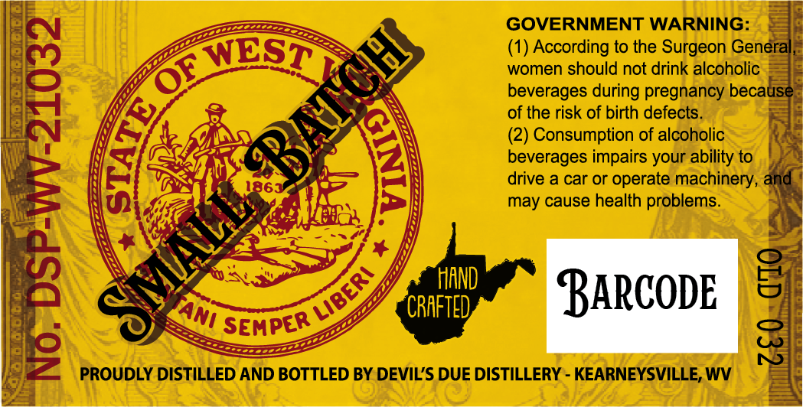
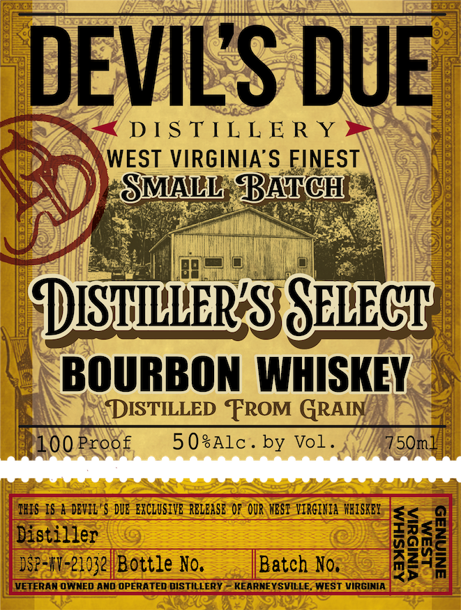
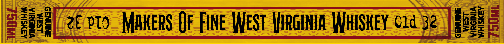

# TTB COLA Label Images - TTBID 26140001000435

**Brand Name:** DEVIL'S DUE DISTILLERY

**Fanciful Name:** DISTILLER'S SELECT BOURBON

**Issue Date:** 05/27/2026

**Origin Code:** 47

**Product Class/Type:** 111

**Source:** [TTB Public COLA Registry](https://ttbonline.gov/colasonline/viewColaDetails.do?action=publicFormDisplay&ttbid=26140001000435)

## Label Images

### Back Label

### Front Label

### Label 3

### Label 4

## Extracted Label Text

*Text extracted via OCR - may contain errors*

**Detected Proof:** 100

### Back Label

GOVERNMENT WARNING:
WEST
(1) According to the Surgeon General
women should not drink alcoholic
beverages during pregnancy because
of the risk of birth defects__
(2) Consumption of alcoholic
1
deveragar Or operaourabiinetx,
and
may cause health problems_
'HAND
BARCODE
8
'CRAFTED
SEMPER
2
8
PROUDLY DISTILLED AND BOTTLED BY DEVIL'S DUE DISTILLERY
KEARNEYSVILLE; WV
E
OF
6
1
MAiL
LIBERI
TAni

### Front Label

DEVILS DUE
DS TIL L E R Y
WEST VIRGINIA'S FINEST
SMAL; BATCH
DISHuRSSHLECH
BOURBON  WHISKEY
DISTILLED FROM GRAIN
100 Proof
5 0sAlc
by Vol _
5Om
IHIS IS a DEVIL '$ diE CXCLUSIVE RELEASE OF OUR MEST VIRGIKIA  MRISKEY
<
Distizzerz Bottle Ka,
Batch No.
I
VETERAN OWNED AND OPERATED DISTILLERY
KEARNEYSVILLE, WEST VIRGINIA
S

### Label 3

AAYSIHM
VINISUIA
LSaM

(2 vto MAKERS OF FINE WEST VIRGINIA WHISKEY 01a 32 | 2889

### Label 4

BOTTLED IN BOND
SINGLE BARREL SELECT
