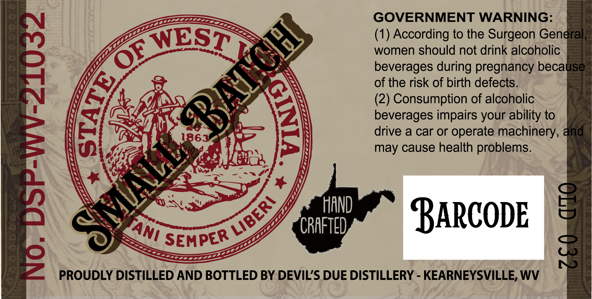
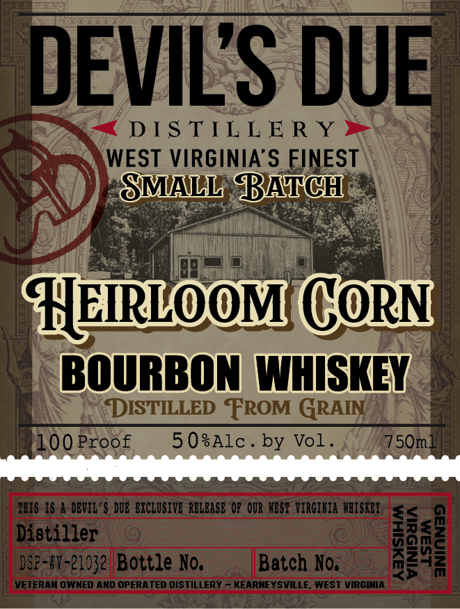
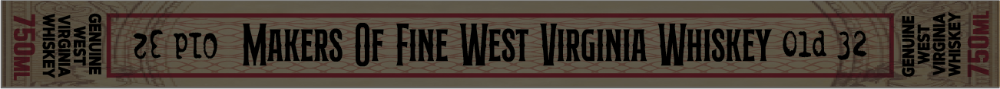

# TTB COLA Label Images - TTBID 26140001000457

**Brand Name:** DEVIL'S DUE DISTILLERY

**Fanciful Name:** HEIRLOOM CORN BOURBON

**Issue Date:** 05/27/2026

**Origin Code:** 47

**Product Class/Type:** 111

**Source:** [TTB Public COLA Registry](https://ttbonline.gov/colasonline/viewColaDetails.do?action=publicFormDisplay&ttbid=26140001000457)

## Label Images

### Back Label

### Front Label

### Label 3

### Label 4

## Extracted Label Text

*Text extracted via OCR - may contain errors*

**Detected Proof:** 100

### Back Label

GOVERNMENT WARNING:
(1) According to the Surgeon General
69
women should not drink alcoholic
beverages during pregnancy because
of the risk of birth defects.
(2) Consumption of alcoholic
1
1863
Gaverager Or oerao uractinery &nd
may cause health problems.
HAND
BaRcodE
8
CRAFTED
SEMPER
2
PROUDLY DISTILLED AND BOTTLED BY DEVILS DUE DISTILLERY
KEARNEYSVILLE, WV
8
BBATGH
WEST
E
1
3
LIBERI
'TAni

### Front Label

DEVILS DUE
DIS TIL L E R Y
WEST VIRGINIA'S FINEST
SMALL BATCH
HHRLOOM CORN
BOURBON WHISKEY
DISTILLED FROM GRAIN
100Proof
5 0sAlc _
by Vol .
75Oml
VBIS 1S a DBVIL'$ DUB EXCLUSIVE RCLBASB Op OUR MESI VIRGIHIA WAISKEY
<
Disti-zeyz Bottle Xo,
Batch No:
M
VETERAM OWNED AND OPERATED DISTILLERY
KEARNEY SVILLE
WEST VIRGINIA

### Label 3

G)i;| 2 oto MAWERS OF FINE WEST VIRGINIA WHISKEY 1a 32. [3

WEST
VIRGINIA
WHISKEY

### Label 4

BOTTLED IN BOND
SINGLE BARREL SELECT
