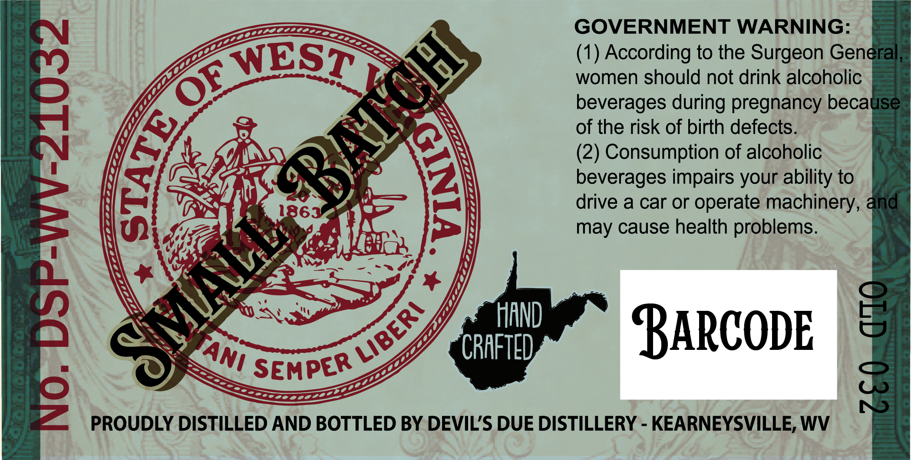
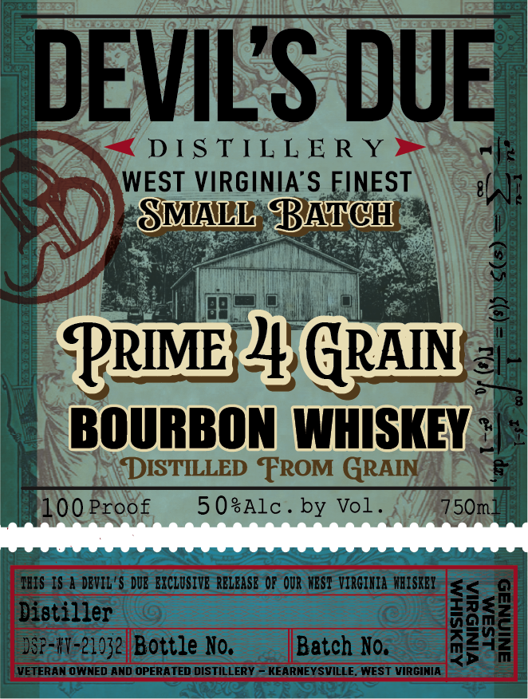
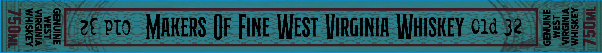

# TTB COLA Label Images - TTBID 26140001000464

**Brand Name:** DEVIL'S DUE DISTILLERY

**Fanciful Name:** PRIME FOUR GRAIN BOURBON

**Issue Date:** 05/27/2026

**Origin Code:** 47

**Product Class/Type:** 111

**Source:** [TTB Public COLA Registry](https://ttbonline.gov/colasonline/viewColaDetails.do?action=publicFormDisplay&ttbid=26140001000464)

## Label Images

### Back Label

### Front Label

### Label 3

### Label 4

## Extracted Label Text

*Text extracted via OCR - may contain errors*

**Detected Proof:** 100

### Back Label

GOVERNMENT WARNING:
(1) According to the Surgeon General
women should not drink alcoholic
beverages during pregnancy because
of the risk of birth defects.
(2) Consumption of alcoholic
1
1863
deverager or oerae urathinery,
and
may cause health problems.
HAND
BaRcodE
8
CRAFTED
SEMPER
2
8
PROUDLY DISTILLED AND BOTTLED BY DEVILS DUE DISTILLERY
KEARNEYSVILLE; WV
BALCH
XESTR
[
1
E
LIBERI
'TAni

### Front Label

DEVILS DUE
DS TIL L E R Y
WEST VIRGINIA'S FINEST
SMALL BATCH
PRIMB4 Gran
BOURBON WHISKEY
DISTILLED FROM GRAIN
100 Proof
5 0sAlc _
by Vol .
5Om_
IBIS IS A DEVIL'$ DUB EXCLUSIVE RBLBASE Op OUR KBST ViRGIHIA  HAISKBY
<
Dictizzerg Bottle Ko,
Batch No:
I
VETERAN OWNED AND OPERATED DISTILLERY
KEARNEYSVILLE
WEST VIRGIMIA

### Label 3

BOTTLED IN BOND
SINGLE BARREL SELECT

### Label 4

EUM
2C ptO
MhkerS Of FINe West LJIRGINIA WHISKEY O1d 32
We
