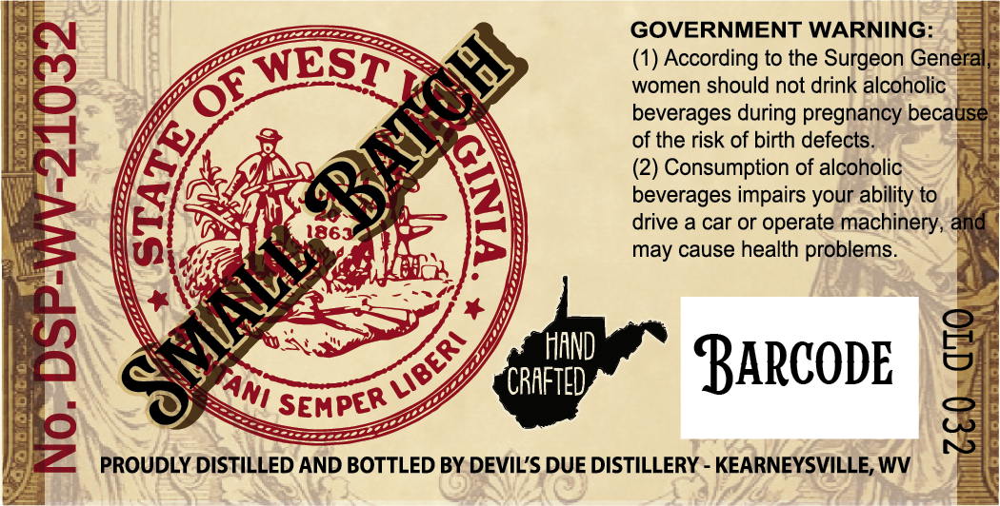
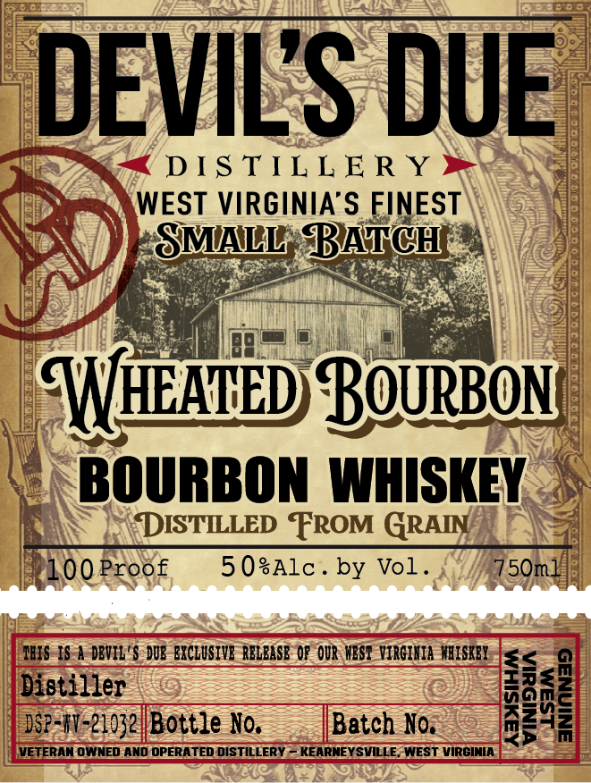
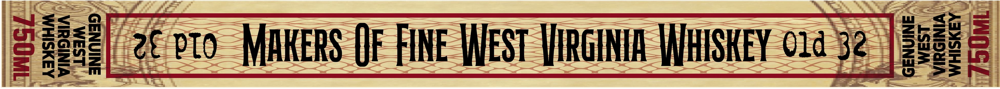

# TTB COLA Label Images - TTBID 26140001000467

**Brand Name:** DEVIL'S DUE DISTILLERY

**Fanciful Name:** WHEATED BOURBON

**Issue Date:** 05/27/2026

**Origin Code:** 47

**Product Class/Type:** 111

**Source:** [TTB Public COLA Registry](https://ttbonline.gov/colasonline/viewColaDetails.do?action=publicFormDisplay&ttbid=26140001000467)

## Label Images

### Back Label

### Front Label

### Label 3

### Label 4

## Extracted Label Text

*Text extracted via OCR - may contain errors*

**Detected Proof:** 100

### Back Label

GOVERNMENT WARNING:

E

Ione

ip

WEST

(1) According to the Surgeon Gen

Y

SNS

RO

women should not drink alcoholic =

~S

~

beverages during pregnancy becai

of the risk of birth defects.

+A

y

GANS Qe

Std

(2) Consumption of alcoholic

nA

Sy

beverages impairs your ability to

i

>

ly

Las

=

= |

drive a car or operate machinery,

ye

.

may cause health problems.

WEG

fos

\

PANS

ve,

i

i ANy

“a

A

=

cs.

yy

N,

S

HAND

CS

CRAFTED

BARCODE

U7)

EMPER

SS

SS

eee

a

| WP

PROUDLY DISTILLED AND BOTTLED BY DEVIL'S DUE DISTILLERY - KEARNEYSVILLE, WV

\

### Front Label

DEVILS DUE
DIS TIL L E R Y
WEST VIRGINIA'S FINEST
SMALL BATCH
WHEAHED Bourbon
BOURBON  WHISKEY
DISTILLED FROM GRAIN
100Proof
5 0sAlc _
by Vol .
750ml
ILIS IS a DBVIL'$ DUB EKCLUSIVE RELBASB 0p OUR MEST VIRGIKIA WRISKBI
Disti-2ey- Bottze No,
Batch No.
M
{VETERAN OWNED AND OPERATED DISTILLERY ~ KEARNEYSVILLE_WEST VIRGINIA

### Label 3

AAYSIHM
VINIS&IA
LSaM

[2 oto MAKERS OF FINE WEST VIRGINIA WHISKEY c1a'5@ | 28896

~~

### Label 4

BOTTLED IN BOND
SINGLE BARREL SELECT
