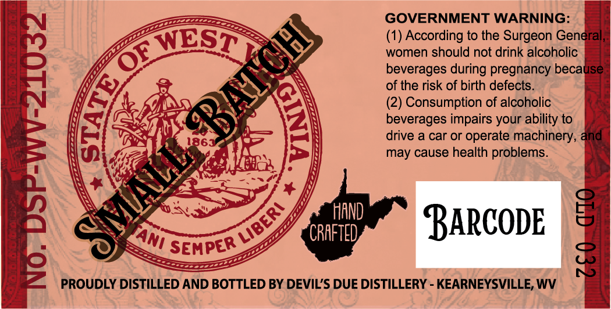
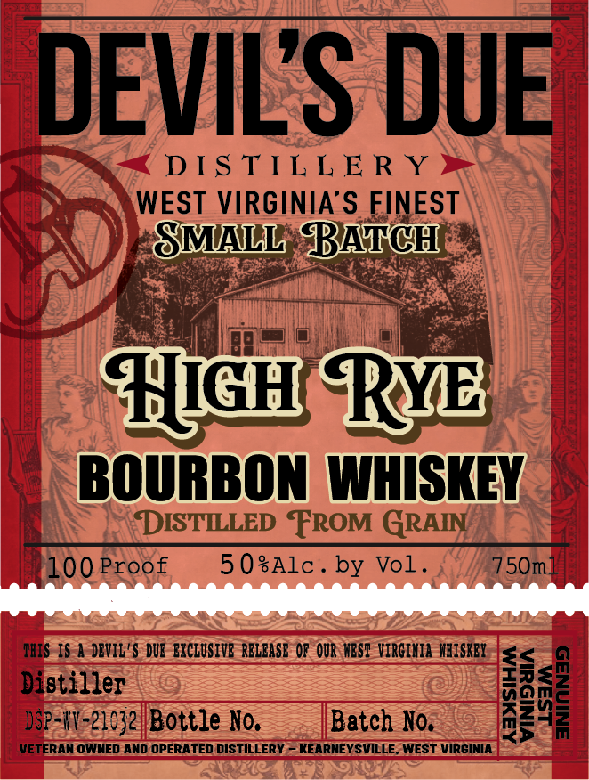
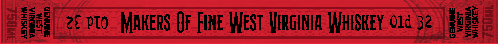
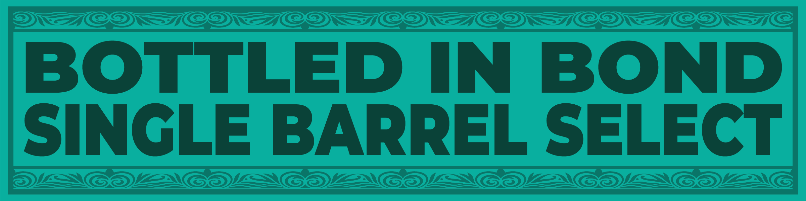

# TTB COLA Label Images - TTBID 26140001000470

**Brand Name:** DEVIL'S DUE DISTILLERY

**Fanciful Name:** HIGH RYE BOURBON

**Issue Date:** 05/28/2026

**Origin Code:** 47

**Product Class/Type:** 111

**Source:** [TTB Public COLA Registry](https://ttbonline.gov/colasonline/viewColaDetails.do?action=publicFormDisplay&ttbid=26140001000470)

## Label Images

### Back Label

### Front Label

### Label 3

### Label 4

## Extracted Label Text

*Text extracted via OCR - may contain errors*

**Detected Proof:** 100

### Back Label

GOVERNMENT WARNING:
WESTT
(1) According to the Surgeon General
women should not drink alcoholic
beverages during pregnancy because
of the risk of birth defects.
(2) Consumption of alcoholic
1
86=
deverager Or Qerarourabhinery &nd
may cause health problems_
HAND
BARCODE
8
CRAFTED
SEMPER
8
PROUDLY DISTILLED AND BOTTLED BY DEVIL'S DUE DISTILLERY
KEARNEYSVILLE, WV
BALYH
OF
6
0
MLLL
LIBERI
TAnI
g

### Front Label

DEVILS DUE
DS TIL L E R Y
WEST VIRGINIA'S FINEST
SMALL BATCH
#GH RYB
BOURBON WHISKEY
DISTILLED FROM GRAIN
100 Proof
5 OsAlc _
by Vol _
750m_
THIS IS | DEVIL' $ DUE BXCLUSIVB RBLBASE OR OUR MBST VIRGIHIA  HBiSKBY
946tiz20- Bottle KG,
Batch No.
M
VETERAN OWNED AND OPERATED DISTILLERY
KEARNEYSVILLE_ WEST VIRGINIA

### Label 3

eMM
ZC pTo
MAkeRS Of FIne West HIRGINIA WHSKEY O1d 32
Ie

### Label 4

BOTTLED IN BOND
SINGLE BARREL SELECT
