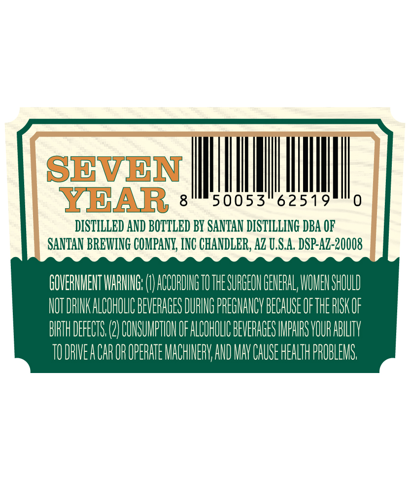
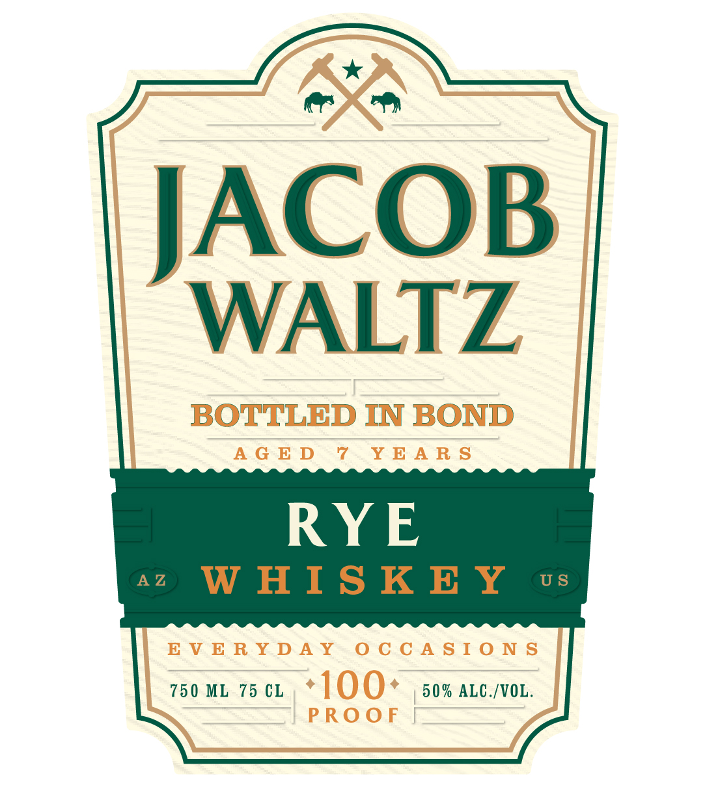

# TTB COLA Label Images - TTBID 26140001000533

**Brand Name:** JACOB WALTZ

**Fanciful Name:** RYE WHISKEY BOTTLED IN BOND AGED 7 YEARS

**Issue Date:** 06/03/2026

**Origin Code:** 11

**Product Class/Type:** 112

**Source:** [TTB Public COLA Registry](https://ttbonline.gov/colasonline/viewColaDetails.do?action=publicFormDisplay&ttbid=26140001000533)

## Label Images

### Back Label

### Front Label

## Extracted Label Text

*Text extracted via OCR - may contain errors*

**Detected Age:** 7 Years

### Back Label

SBVEN
YBAR
8
50053
62519
0
DISTILLED AND BOTTLED By SANTAN DISTILLING DBA OF
SANTAN BREWING COMPANY, INC CHANDLER, AZ U.S.A: DSP-Az-20008
GOVERHMEHT WAIING;
ACCORDIG TU THE SURGEON GEHERAL; WOMEH SHOULD
NOT DRINK ALCOHOLIC BEVERAGES DURING PREGNANCY BECAUSE OFTHE RISKOF
BRTH DEFECTS
COHSUMPTIOH OF ALCOHOLIC BEVERAGES IMPARS VOUR ABLLTV
TO DRWEA CAROR OPERATE MACHINERV AND MNY CAUSE HEALTH PROBLEMS

### Front Label

BB

ACOB

WALTZ

BOTTLED IN BOND

AGED 7 YEARS

RYE

EVERYDAY OCCASIONS

750 ML 75 CL, * | 00+ 50% ALG./VOL.

PROOF
