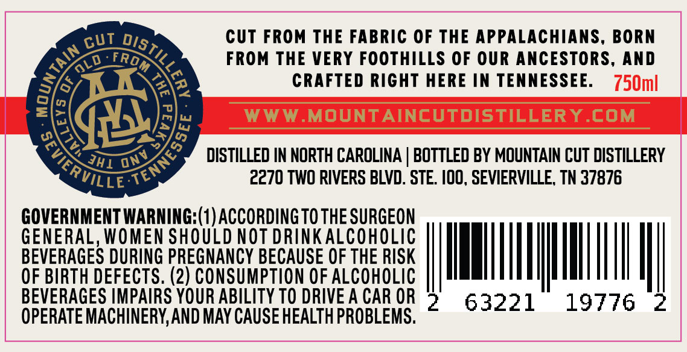
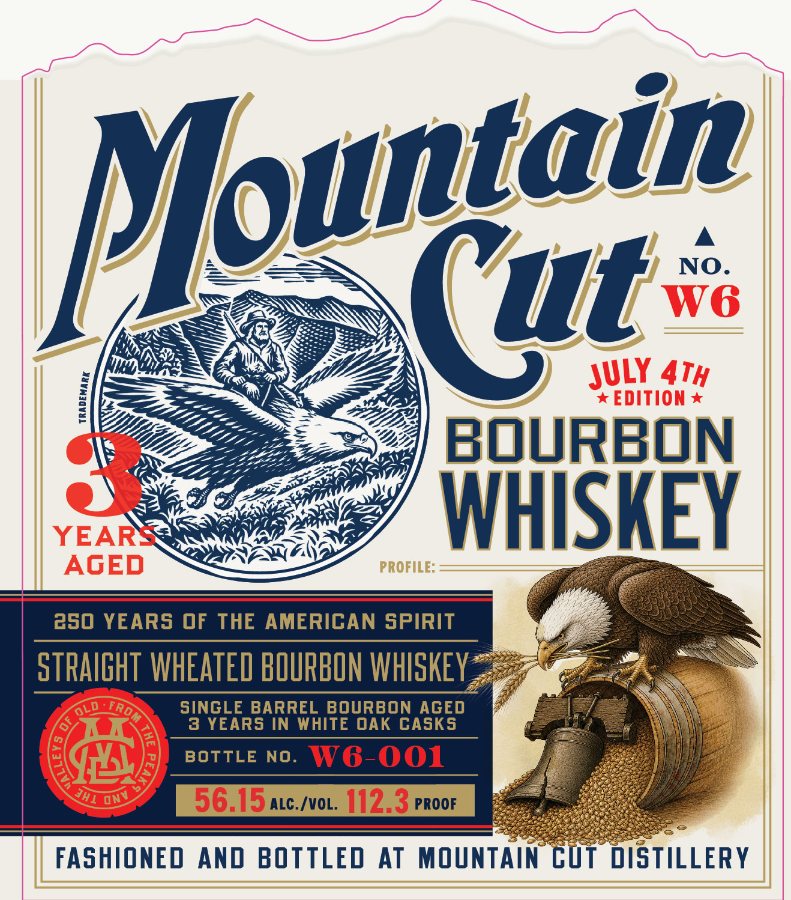

# TTB COLA Label Images - TTBID 26140001000573

**Brand Name:** MOUNTAIN CUT

**Fanciful Name:** WHEATED BOURBON

**Issue Date:** 05/29/2026

**Origin Code:** 43

**Product Class/Type:** 141

**Source:** [TTB Public COLA Registry](https://ttbonline.gov/colasonline/viewColaDetails.do?action=publicFormDisplay&ttbid=26140001000573)

## Label Images

### Back Label

### Label 1

## Extracted Label Text

*Text extracted via OCR - may contain errors*

**Detected Age:** 3 Years

### Back Label

cUT FROM THE FABRIC OF THE APPALACHIANS, BORN
0
FROM THE VERY FOOTHILLS OF OUR ANCESTORS, AND
J
CRAFTED RIGHT HERE IN TENNESSEE:
750ml
8
WWW.MOUNTAINCUTDISTILLERYCOM
DISTILLED IN NORTH CAROLINA
BOTTLED BY MOUNTAIN CUT DISTILLERY
2270 TWO RIVERS BLVD: STE  IOO, SEVIERVILLE, TN 37876
GOVERNMENT WARNING:(1) ACCORDING TO THE SURGEON
GENERAL, WOMEN SHOULD NOT DRINKALCOHOLIC
BEVERAGES DURING PREGNANCY BECAUSE OF THE RISK
OF BIRTH DEFECTS. (2) CONSUMPTION OF ALCOHOLIC
BEVERAGES IMPAIRS YOUR ABILITY TO DRIVE A CAR OR
63221
19776
OPERATE MACHINERY,AND MAY CAUSE HEALTH PROBLEMS.
CUT
DISZ
I
Trom
1
1
[
3
5
SeviERVILLY
TENNE
ONV
JHI

### Label 1

Mountain
NO
(ut
W6
ATH
*EDITION
BOuRBON
3
YEARS
WHISKEY
AGED
PROFILE:
250 YEARS OF THE AMERICAN SPIRIT
STRAIGHT WHEATED BOURBON WHISKEY
FR
sinGLE BARREL BOuRBON AGED
3 YEARS IN WHITE OAK CASKS
BOTTLE NO.
W6-001
56 [5ac /voL 1123 PRoor
FASHIONED
And BOTTLED
AT
MOUNTAIN CUT  DISTILLERY
JULY
7
JhI
onv
