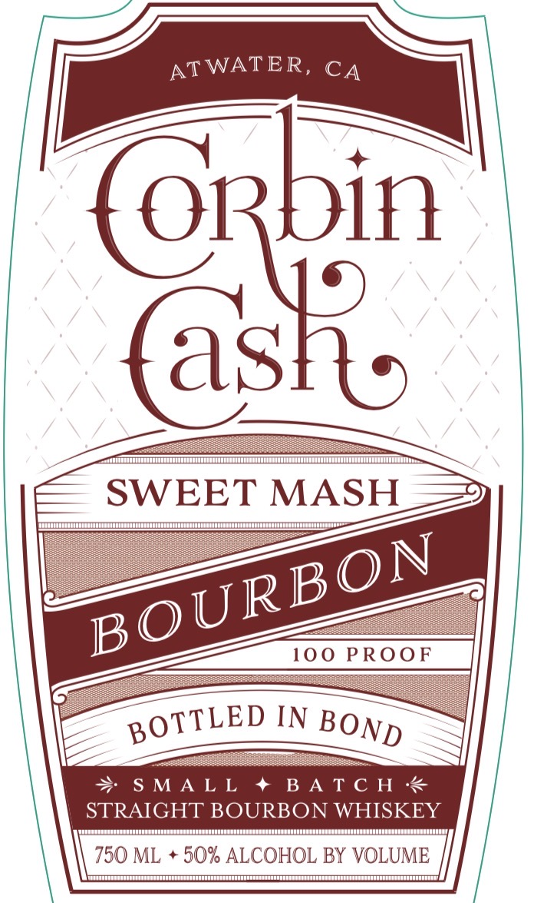
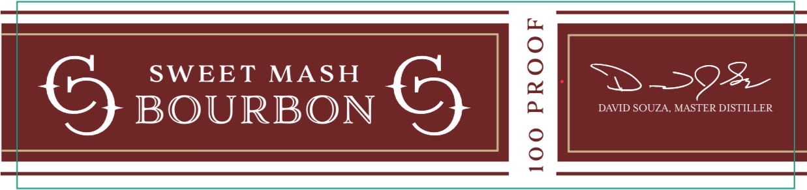
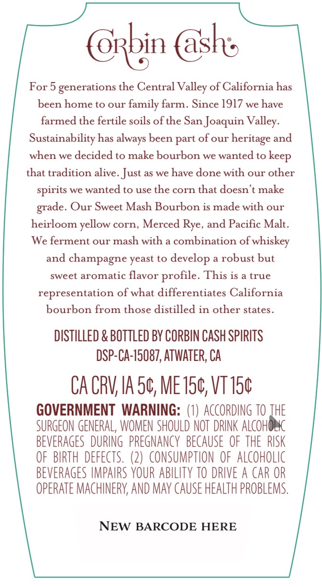

# TTB COLA Label Images - TTBID 26140001000713

**Brand Name:** CORBIN CASH

**Issue Date:** 06/01/2026

**Origin Code:** 01

**Product Class/Type:** 111

**Source:** [TTB Public COLA Registry](https://ttbonline.gov/colasonline/viewColaDetails.do?action=publicFormDisplay&ttbid=26140001000713)

## Label Images

### Label 1

### Label 2

### Label 3

## Extracted Label Text

*Text extracted via OCR - may contain errors*

**Detected Proof:** 100

### Label 1

—

—

If}

(oR

{as

SWEET MASH

RBON

BOU

gOTTLED IN Boy

> S

YTRAIGHT BOURBON WIE KEY

750 ML + 50% ALCOHOL BY VOLUME

### Label 2

6
SWEET
MASH
0
1
3-328
BOURBON
DAVID SOUZA, MASTER DISTILLER
8

### Label 3

Grbin @bhe

For 5 generations the Central Valley of California has

been home to our family farm. Since 1917 we have

farmed the fertile soils of the San Joaquin Valley.

Sustainability has always been part of our heritage and

when we decided to make bourbon we wanted to keep

that tradition alive. Just as we have done with our other

spirits we wanted to use the corn that doesn’t make

grade. Our Sweet Mash Bourbon is made with our

heirloom yellow corn, Merced Rye, and Pacific Malt.

We ferment our mash with a combination of whiskey

and champagne yeast to develop a robust but

sweet aromatic flavor profile. This is a true

representation of what differentiates California

bourbon from those distilled in other states.

DISTILLED & BOTTLED BY CORBIN CASH SPIRITS

DSP-CA-15087, ATWATER, CA

CACRV, IA 5¢, MET5¢, VT T5¢

GOVERNMENT WARNING: (1) ACCORDING 10 THE

SURGEON GENERAL, WOMEN SHOULD NOT DRINK ALCOH

BEVERAGES DURING PREGNANCY BECAUSE OF THE RISK

OF BIRTH DEFECTS. (2) CONSUMPTION OF ALCOHOLIC

BEVERAGES IMPAIRS YOUR ABILITY TO DRIVE A CAR OR

OPERATE MACHINERY, AND MAY CAUSE HEALTH PROBLEMS

NEW BARCODE HERE
