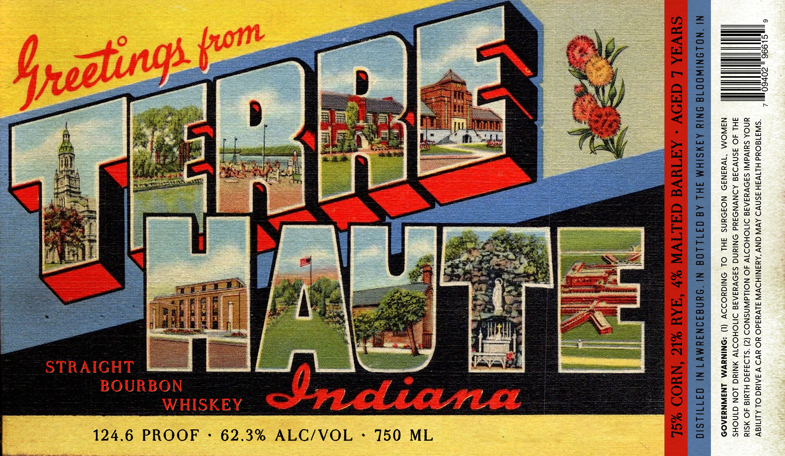

# TTB COLA Label Images - TTBID 26140001000722

**Brand Name:** TERRE HAUTE

**Issue Date:** 05/27/2026

**Origin Code:** 19

**Product Class/Type:** 101

**Source:** [TTB Public COLA Registry](https://ttbonline.gov/colasonline/viewColaDetails.do?action=publicFormDisplay&ttbid=26140001000722)

## Label Images

### Label 1

## Extracted Label Text

*Text extracted via OCR - may contain errors*

**Detected Proof:** 124.6

### Label 1

santas ts —
eee eee ees a Me oo ——T
Pe ae ee is tie bars: Ss
eRe a 3 Re fs - ce. _ a ie!
KEES $ 3 eee =
a . 2 2. er — —o
ate a y th > Na = oa PS fen) ——————— oe
ee eat Ng bea — ——o
fem Pe RGN ¥ ee ey — Ee
— ee —. Foot Piles. Bi ies ? a)
wpe Sheets ep S cease} ec a 2 3
eee Pe ae erat ae a Sh seetek Se ; ge oS < fom Eos
rey. eae Set re 4 Ress &, Pie ar £5 Pate ay +1 Si S 2
ot (ePRh fh eae ee 5 aid ts a ia bi Bond < B28 [ils patsy epay 33 Se 4 aa
ere I SOE a i moe BB aT Oa Be ae a) st =] fj ae £ ey)
; ie fe | ey] Se ee eee Oe coe
= ee ee rhe ee SAS Rie BE Smile 4 a po Bea
A we Pee % G3 Psor ere eye ee og apa Seman eo = apie = z 422
beaks Sy me 6 se Sis 5 . ay ee means PSR 4 PO So pep % 5: oA
: : ah fg! PFE biti eclaupere. eae — 4 ee E: gee eee = = Yung
Nae ep Sune kt Ri tas rie Reon Sec enh rh SBR Sterner mine Ore hee ral ug Ow
y ed Derek ay ene Se ea oe - tS OS OES IS Be 2268
z sees : : Sree coat = ME G2 I SS rae eos ea =z
ne a . rts eer a Seer Pee: fare . 2 a ee oe > 9 Zia
Se ene . +e Been eee eau are rane raemo ieee ee oo OooOonad0
Secs ‘ S Mn SoS Or Rae ” as SOR nc Da TE a SS See rf]
nce 4 © Sats ay ben coon See SEAS Se eee cena ; a o>
Soa ey Raa Soa tants hry amen Eee Pst ee ee 2B 2 Gs = 3
eerie sas dea Pe She =
eee fc eg = : aS eee eres nena = Qia
oes |} s&s ' ae we oe Bee eres eer me 20 z
ees PS NO ee ee ea ak a Sag AF IR sain A eae Meme 0Oaae
= | Reece * be - ag I RP a pS ees BE no Bey 2 OS
Paea V" 5' fey ee ; | oor I a setieet oe SON bg = ee ae
capt es Aes ‘ : Sp Ss : mee ee wy Mane” karen © = Besa
Ree opie arth ies i TAtoe a is Pe Be eee earn ie am = = ro)
Rare Picea Sats ees ee tat i 8 Oh OR OR ct Das co: ¥ q = Bono 2
ee soos owe fir ee cnt rg * # aprecnitinn  IS : iz we Ss
So aS fe he ie oo Se ia tS SS = Bee
ON ES Et Soe ae ee ee ee Se Poe Die gee ce Be ee igh ioe = oe
orci cure ees Ree a 1 oa eos 6 &: 220 eee Bae 6 Ee! Pe 3% we. me UU Bow
Shoes 2 a ee SAS st ore ty #3 i EEE EE “eg Be 5 os eee Mee his Sag ee Re A — | a a
PS A eS rea So 8 Re ee Si Ke & etn eS. ie cE SY ee ee re weet Sora asaiceae = 5
eee es a ease | - — Slee HTT fas Se Me 520
weet Passed Se ee pect ie SE: a Use, Ue 2p) tes Perera ga a .: nL ad Fosse SOSA, ie of2o
Seeeee ae ae hmm Bes see eee. 1 er oe oe , q ee cere m= = ergo
eee seh ae SS ie : a ee iid = Bares
aE eS ER SS Sexe ‘Soren dhe Aten Mie [eres 3 ie iu
Tee eos nar Seeenice ee Se Lee eee: WV eS RRR a eenmearenisnnes : Zu<
» (, Stony tas SS ee =f
CTP ATCUT Ee eoemenee 9 Sexe toe © «ee
Se ee {| d . Be
ROTIRBON ‘ = ; a 2 | mm S250
DUUVUABUN } - Oe 4 = Zaout
i 29 J r ; 3 7 a — =
WHISKEY , es os i WSO
VV AION Bt Me 30%2
50 ML _
9 ° ;
124.6 PROOF + 62.3% ALC/VOL : 7
