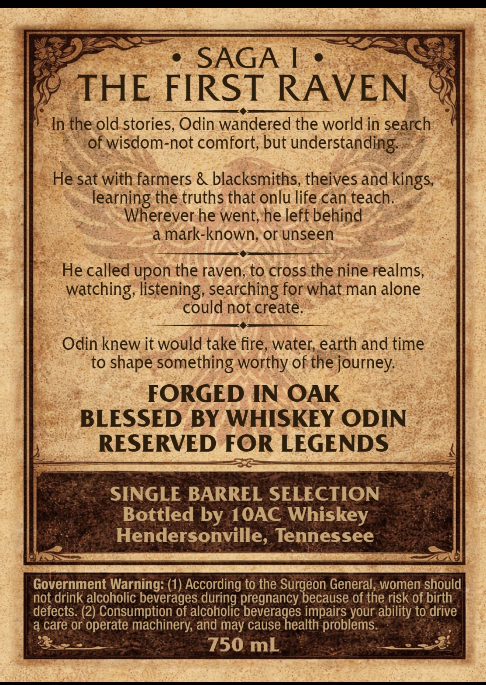
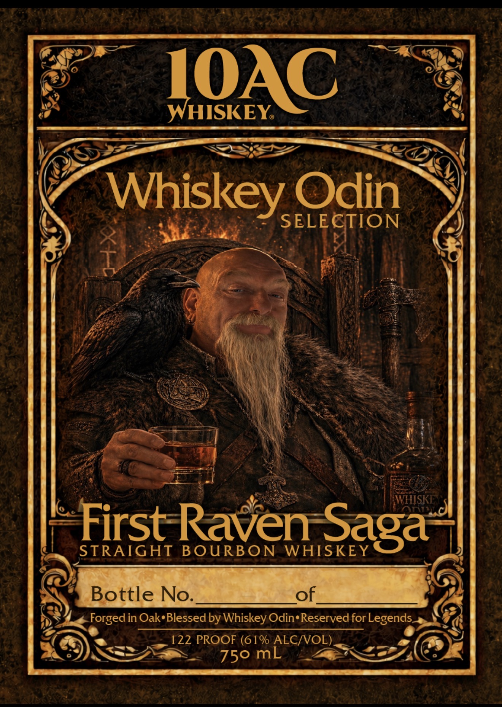

# TTB COLA Label Images - TTBID 26141001000009

**Brand Name:** 10AC WHISKEY

**Fanciful Name:** FIRST RAVEN SAGA

**Issue Date:** 05/27/2026

**Origin Code:** 43

**Product Class/Type:** 101

**Source:** [TTB Public COLA Registry](https://ttbonline.gov/colasonline/viewColaDetails.do?action=publicFormDisplay&ttbid=26141001000009)

## Label Images

### Back Label

### Label 1

## Extracted Label Text

*Text extracted via OCR - may contain errors*

**Detected Proof:** 122

### Back Label

SAGA
THE
FIRST
RAVEN
In the old stories; Odin wandered the world in search
of wisdom-not comfort; but
understanding:
He sat with farmers & blacksmiths,theives and kings,
learning the truths that onlu life can teach:
Wherever he went; he left behind
a
mark-known; or unseen
He called upon the raven; to cross the nine realms,
watching; listening, searching for what man alone
could not create
Odin knew it would take fire, water; earth and time
to shape something worthy of the journey:
FORGED IN OAK
BLESSED BY WHISKEY ODIN
RESERVED FOR LEGENDS
SINGLE BARREL SELECTION
Bottled by IOAC Whiskey
Hendersonville, Tennessee
Government Warning: (1) According to the Surgeon General , women should
not drink alcoholic beverages during pregnancy because of the risk of birth
defects. (2) Consumption of alcoholic beverages impairs your ability t0 drive
a care or operate machinery; and may cause health problems:
750 mL

### Label 1

IOAC
WHISKEY
Whiskey Odin
SELECTION
WHISKE
First Raven Saga
STRAIGHT
BOURBON
Bottle No:
Forged in Oak Blessed by Whiskey Odin Reserved for Legends
122 PROOF (61% ALC/VOL)_
750 mL
