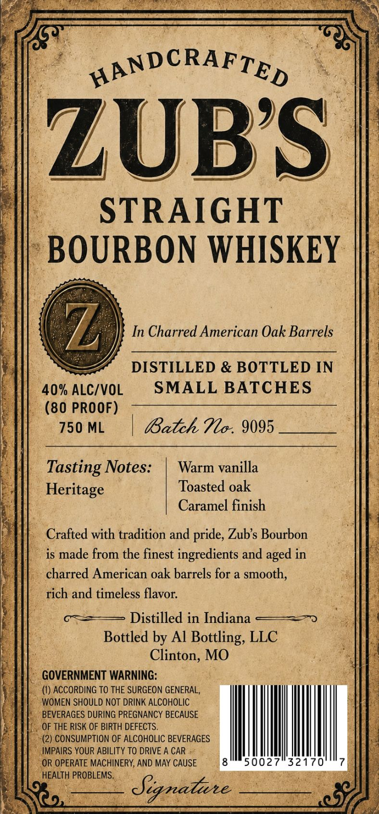

# TTB COLA Label Images - TTBID 26141001000051

**Brand Name:** ZUB'S

**Issue Date:** 06/30/2026

**Origin Code:** 29

**Product Class/Type:** 101

**Source:** [TTB Public COLA Registry](https://ttbonline.gov/colasonline/viewColaDetails.do?action=publicFormDisplay&ttbid=26141001000051)

## Label Images

### Label 1

## Extracted Label Text

*Text extracted via OCR - may contain errors*

**Detected Proof:** 80

### Label 1

HANDCRAFTED
ZUBS
STRAIGHT
BOURBON WHISKEY
Z,
In Charred American Oak Barrels
DISTILLED & BOTTLED IN
40% ALCIVOL
SMALL BATCHES
(80 PROOF)
750 ML
Batch Tlo . 9095
Tasting Notes:
Warm vanilla
Heritage
Toasted oak
Caramel finish
Crafted with tradition and pride, Zubs Bourbon
is made from the finest ingredients and
in
charred American oak barrels for a smooth,
rich and timeless flavor:
Distilled in Indiana
Bottled by Al
Bottling, LLC
Clinton, MO
GOVERNMENT WARNING:
(I) ACCORDING TO THE SURGEON GENERAL,
WOMEN SHOULD NOT DRINK ALCOHOLIC
BEVERAGES DURING PREGNANCY BECAUSE
OF THE RISK OF BIRTH DEFECTS.
(2) CONSUMPTION OF ALCOHOLIC BEVERAGES
IMPAIRS YOUR ABILITY TO DRIVE A CAR
OR OPERATE MACHINERY, AND MAY CAUSE
50027
32170
HEALTH PROBLEMS.
Signatare
aged
