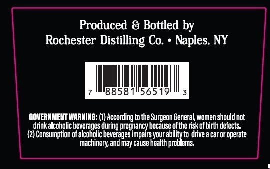
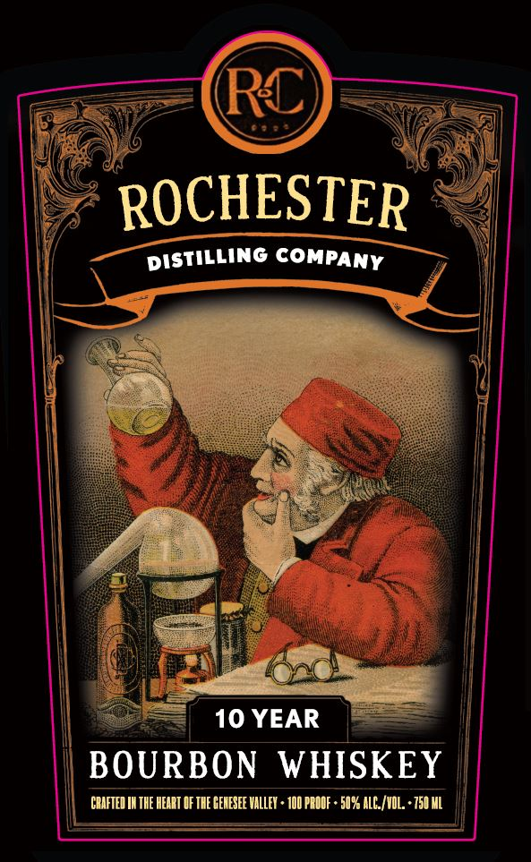

# TTB COLA Label Images - TTBID 26141001000144

**Brand Name:** ROCHESTER DISTILLING COMPANY

**Issue Date:** 05/27/2026

**Origin Code:** 02

**Product Class/Type:** 141

**Source:** [TTB Public COLA Registry](https://ttbonline.gov/colasonline/viewColaDetails.do?action=publicFormDisplay&ttbid=26141001000144)

## Label Images

### Back Label

### Front Label

## Extracted Label Text

*Text extracted via OCR - may contain errors*

**Detected Proof:** 100
**Detected Age:** 10 Years

### Back Label

Produced & Bottled by
Rochester Distilling Co.
Naples; NY
8858
565
GOVERMMENT WARNING: (1) According to the Surgeon General
Ishould not
drinkalcoholic beverages during pregnancy because of therisk of birth defects
Consumption of alcoholic beverages impairs your
drive
car Or
coperate
machinery and may cause health_
Fabronemn dr
women =

### Front Label

RC
ROCHESTER
DISTILLING COMPANY
10 YEAR
BOURBON WHISKEY
CBIFTED IH THE HEART F THE GEHESEE VALLEY + 100 PBODF + 50% ALC_/VOL * 750 ML
