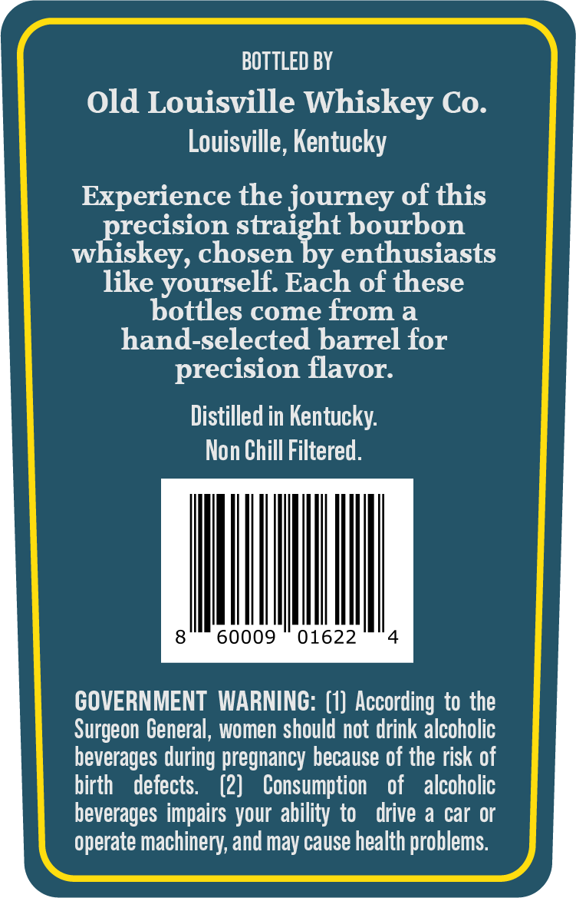
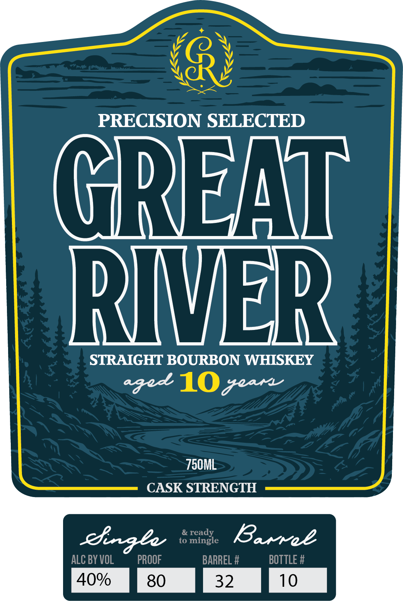

# TTB COLA Label Images - TTBID 26141001000176

**Brand Name:** GREAT RIVER

**Issue Date:** 05/27/2026

**Origin Code:** 22

**Product Class/Type:** 101

**Source:** [TTB Public COLA Registry](https://ttbonline.gov/colasonline/viewColaDetails.do?action=publicFormDisplay&ttbid=26141001000176)

## Label Images

### Back Label

### Front Label

## Extracted Label Text

*Text extracted via OCR - may contain errors*

### Back Label

BOTTLED BY

Old Louisville Whiskey Co.

Louisville, Kentucky

Experience the journey of this

recision straight bourbon

iskey, chosen by enthusiasts

like yourself. Each of these

bottles come from a

hand-selected barrel for

precision flavor.

Distilled in Kentucky.

Non Chill Filtered.

MI

GOVERNMENT WARNING: (1) According to the

Surgeon General, women should not drink alcoholic

beverages during pregnancy because of the risk of

birth defects. (2) Consumption of alcoholic

beverages impairs your ability to drive a car or

operate machinery, and may cause health problems.

### Front Label

PRECISION SELECTED

GREAT

RIVER

STRAIGHT BOURBON WHISKEY

agodk Gore

750ML

CASK STRENGTH

Ringle

Barrek

40% Fso 32 fio
