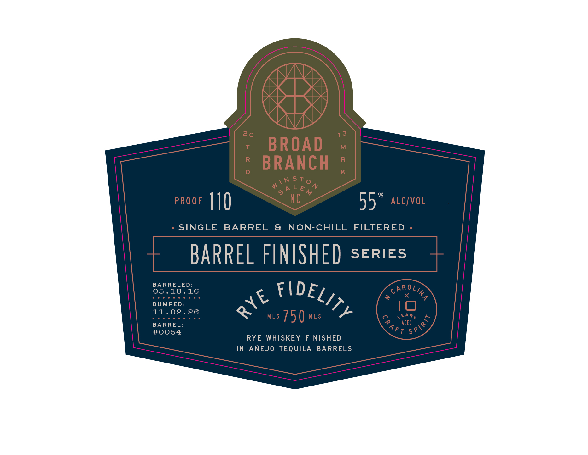
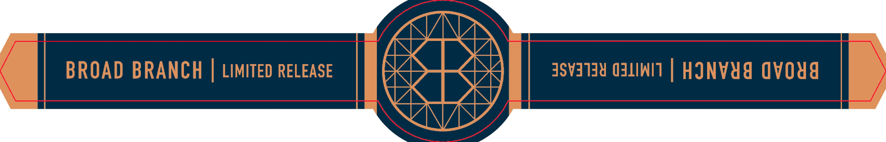
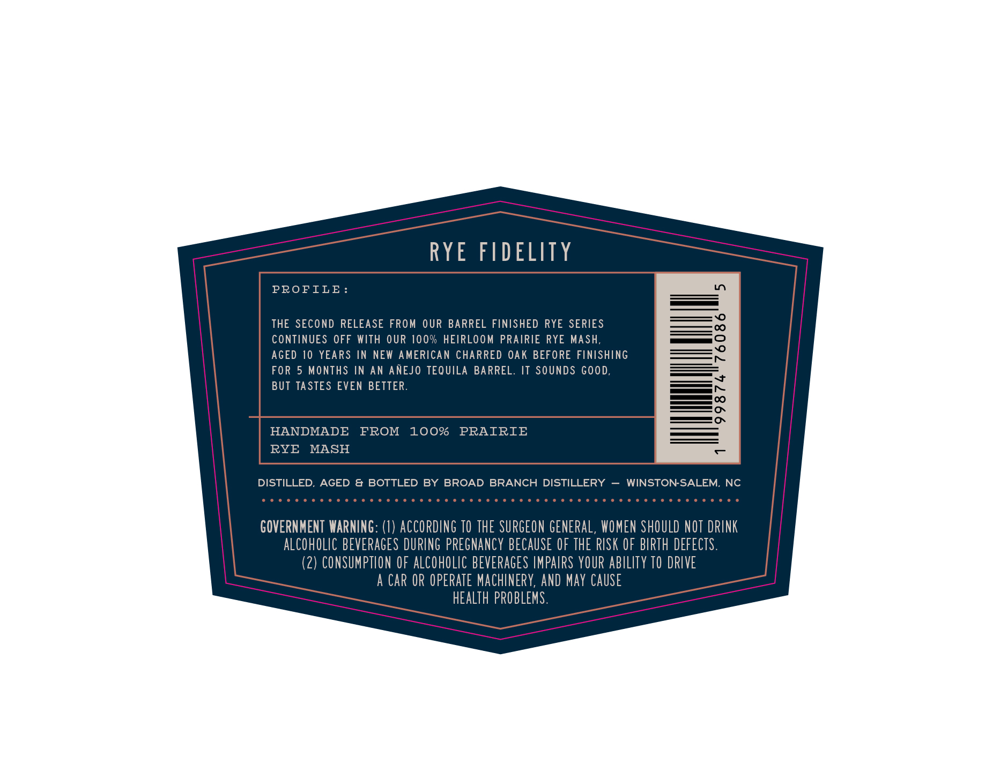

# TTB COLA Label Images - TTBID 26141001000287

**Brand Name:** RYE FIDELITY

**Fanciful Name:** TEQUILA BARREL FINISHED

**Issue Date:** 05/28/2026

**Origin Code:** 35

**Product Class/Type:** 142

**Source:** [TTB Public COLA Registry](https://ttbonline.gov/colasonline/viewColaDetails.do?action=publicFormDisplay&ttbid=26141001000287)

## Label Images

### Label 1

### Label 2

### Label 3

## Extracted Label Text

*Text extracted via OCR - may contain errors*

**Detected Proof:** 110
**Detected Age:** 10 Years

### Label 1

1 3
BROAD
M
R
BRANCH
K
iN STo
N
N
6A LEM
9
PROOF
110
NC
55
ALCIVOL
SINGLE
BARREL
&
NON-CHILL
FILTERED
BARREL FLNISHED
SERIES
BARRELED:
05.18.16
~
X
DUMPED:
10
11.02.26
MLS
750
MLS
EAR$
BARREL:
Aged
#0054
FT
RYE WHISKEY FINISHED
IN
ANEJO TEQUILA BARRELS
20
(IDELITY
JARoLing
RYE
SPIRI<
2

### Label 2

BROAD BRANCH
LIMITED RELEASE
3813138 U31INII
HJNVYA Ovoua

### Label 3

RYE FIDELITY

PROFILE:

=——vo

THE SECOND RELEASE FROM OUR BARREL FINISHED RYE SERIES

—o

CONTINUES OFF WITH OUR 100% HEIRLOOM PRAIRIE RYE MASH,

— 0

—O

AGED 10 YEARS IN NEW AMERICAN CHARRED OAK BEFORE FINISHING

——

FOR 5 MONTHS IN AN ANEJO TEQUILA BARREL. IT SOUNDS GOOD.

BUT TASTES EVEN BETTER.

—«<V\#

oo

_——_

=o

HANDMADE FROM

100%

PRAIRIE

RYE MASH

DISTILLED, AGED & BOTTLED BY BROAD BRANCH DISTILLERY — WINSTON-SALEM,

SOCOM UO OOUDO OUD COCO OUD OOOO ODCOCUCOD UNO OUUUOOOUUUCOOD

GOVERNMENT WARNING: (1) ACCORDING 10 THE SURGEON GENERAL, WOMEN SHOULD NOT DRINK

ALCOHOLIC BEVERAGES DURING PREGNANCY BECAUSE OF THE RISK OF BIRTH DEFECTS.

(2) CONSUMPTION OF ALCOHOLIC BEVERAGES IMPAIRS YOUR ABILITY 10 DRIVE

A CAR OR OPERATE MACHINERY, AND MAY CAUSE

HEALTH PROBLEMS.
