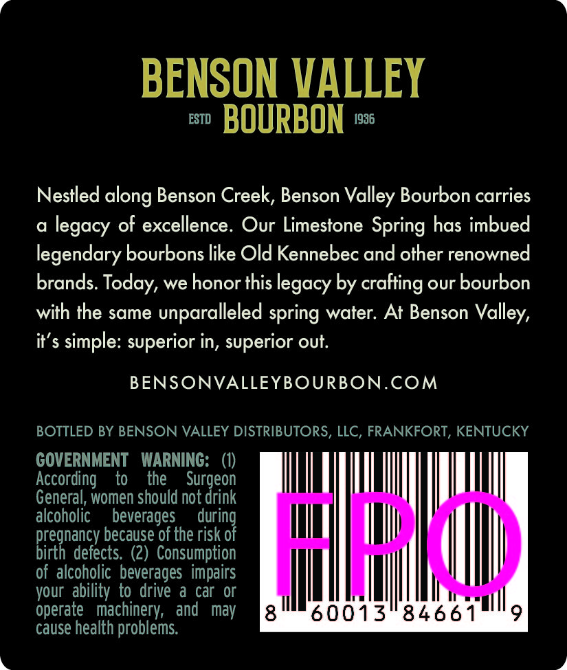
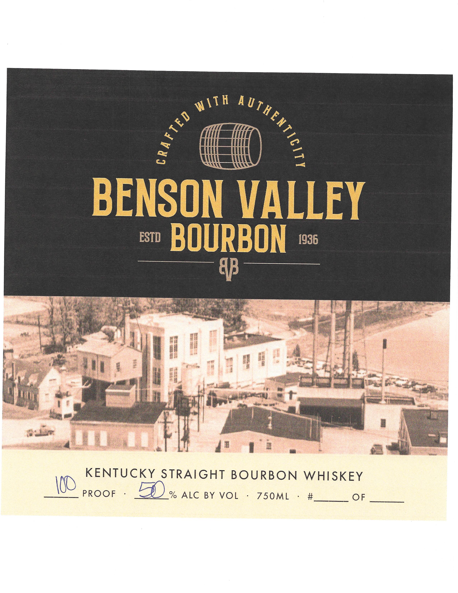

# TTB COLA Label Images - TTBID 26141001000298

**Brand Name:** BENSON VALLEY BOURBON

**Issue Date:** 05/27/2026

**Origin Code:** 22

**Product Class/Type:** 101

**Source:** [TTB Public COLA Registry](https://ttbonline.gov/colasonline/viewColaDetails.do?action=publicFormDisplay&ttbid=26141001000298)

## Label Images

### Back Label

### Label 1

### Label 3

## Extracted Label Text

*Text extracted via OCR - may contain errors*

*1 image(s) excluded: text did not meet readability threshold*

### Back Label

BENSON VALLEY

es BOURBON =

Nestled along Benson Creek, Benson Valley Bourbon carries

a legacy of excellence. Our Limestone Spring has imbued

legendary bourbons like Old Kennebec and other renowned

brands. Today, we honor this legacy by crafting our bourbon

with the same unparalleled spring water. At Benson Valley,

it’s simple: superior in, superior out

BENSONVALLEYBOURBON.COM

BOTTLED BY BENSON VALLEY DISTRIBUTORS, LLC, FRANKFORT, KENTUCKY

GOVERNMENT WARNING:

0)

According

to

the

Surgeon

General, women should not drink

alcoholic

beverages

during

pregnancy because of the risk of

tM

I

birth defects. (2) Consumption

of alcoholic beverages impairs

Hl

your ability to drive a car or

operate machinery, and may

AMEN

ell,

cause health problems.

### Label 1

it

Mi

Hate

at ttt

Ti

AAMAS

ae

BENSON VALLEY

= BOURBON «=

4

we

4

ae

q

Fs

Me By

,

© ae

r

joer foe

a ag gee

at

et

«Tf

rib

ce |

Sn ae

0 eid

ul

43

see

Wescn

KENTUCKY STRAIGHT BOURBON WHISKEY

\D

PROOF

% ALC BY VOL

750ML

#

OF

ent ene
