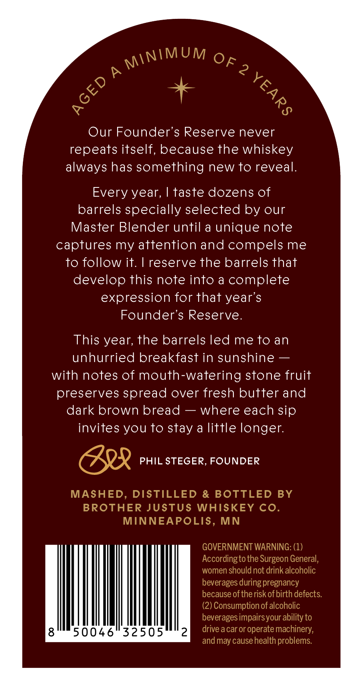
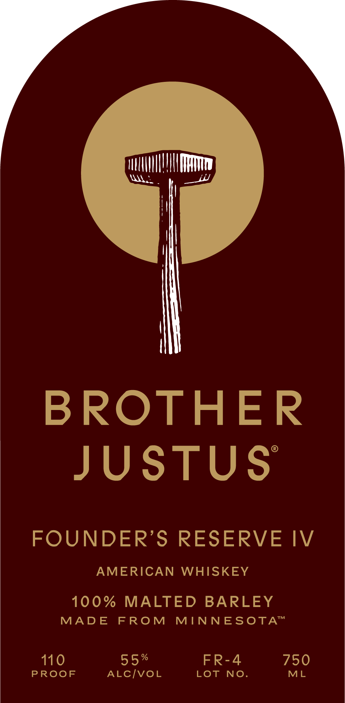

# TTB COLA Label Images - TTBID 26141001000572

**Brand Name:** BROTHER JUSTUS

**Issue Date:** 06/04/2026

**Origin Code:** 27

**Product Class/Type:** 140

**Source:** [TTB Public COLA Registry](https://ttbonline.gov/colasonline/viewColaDetails.do?action=publicFormDisplay&ttbid=26141001000572)

## Label Images

### Back Label

### Front Label

## Extracted Label Text

*Text extracted via OCR - may contain errors*

**Detected Proof:** 110

### Back Label

P
2
Our Founder's Reserve never
repeats itself, because the whiskey
always has something new to reveal:
Every year,
taste dozens of
barrels specially selected by our
Master Blender until a unique note
captures my attention and compels me
to follow it.
reserve the barrels that
develop this note into a complete
expression for that year's
Founder's Reserve.
This year; the barrels led me to an
unhurried breakfast in sunshine
with notes of mouth-watering stone fruit
preserves spread over fresh butter and
dark brown bread
where each sip
invites you to stay a little longer:
PHIL STEGER, FOUNDER
MASHED
DISTILLED
& BOTTLED BY
BROTHER JUSTUS WHISKEY Co
MINNEAPOLIS, MN
GOVERNMENT WARNING: (1)
Accordingto the Surgeon General,
women should not drink alcoholic
beverages during pregnancy
because of therisk of birth defects
(2) Consumptionof alcoholic
beverages impairsyour ability to
8
50046
32505
2
drive acar or operate machinery;
and may causehealth problems:
MINIMUM
OF
[
8

### Front Label

Hl
BROTHER
JUSTUS
FOUNDER'S RESERVE IV
AMERICAN
WHISKEY
100%
MALTED
BARLEY
TM
MAD E
FROM
MINNESOTA
110
55 %
FR-4
750
PROoF
ALCIvoL
LOT
NO
ML
