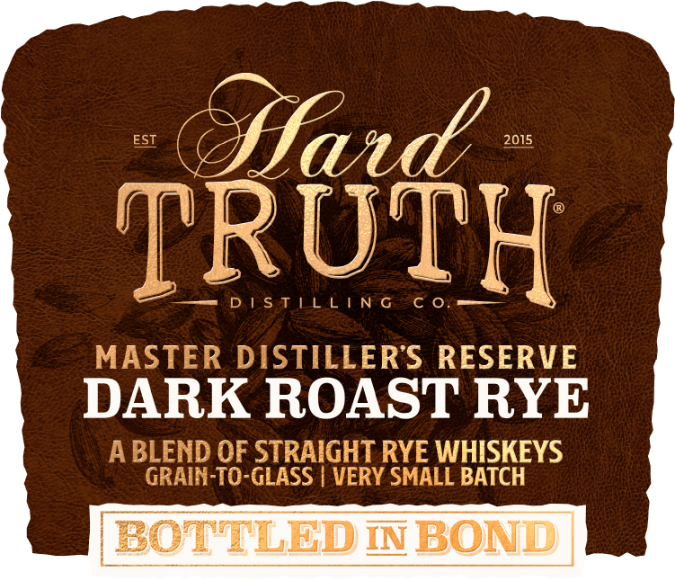
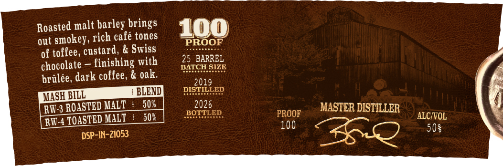

# TTB COLA Label Images - TTBID 26141001000593

**Brand Name:** HARD TRUTH DISTILLING CO.

**Issue Date:** 05/28/2026

**Origin Code:** 19

**Product Class/Type:** 122

**Source:** [TTB Public COLA Registry](https://ttbonline.gov/colasonline/viewColaDetails.do?action=publicFormDisplay&ttbid=26141001000593)

## Label Images

### Back Label

### Label 1

### Label 2

## Extracted Label Text

*Text extracted via OCR - may contain errors*

**Detected Proof:** 100

### Back Label

DISTILLED
WITH THE
FINEST
GRAINS CWATER
BYINDIANAS
SWEET MASH
TM
PIONEERS

### Label 1

ESI
fad
2015
TRUTH
1 S T |L L|N G
C 0
MASTER DISTILLERS RESERVE
DARK ROAST RYE
ABLEND OF STRAIGHT RYE WHISKEYS
GRAIN-TO-GLASS
VERY SMALL BATCH
BOTTLED INBOND

### Label 2

Roasted malt barley brings
100
smokey, rich cafe tones
PROOF
of toffee; custard, & Swiss
chocolate
finishing with
25 BARREL
BATCH SIZE
brulee, dark coffee; & oak;
2019
BLEND
DISTILLED
MASHBILL
RW 3 ROASTED MALT
50%
2026
MASTER DISTILLER
IOASTED MALT
508
BOTTLED
PROOF
ALCIVOL
RW.4
100
DSP-IN-21053
508
out
