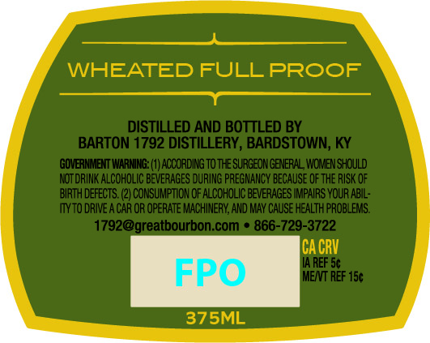
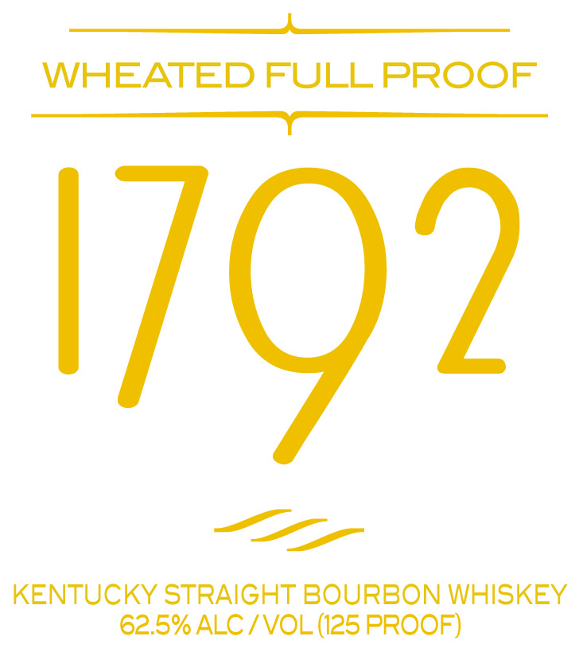

# TTB COLA Label Images - TTBID 26141001000677

**Brand Name:** 1792

**Issue Date:** 05/28/2026

**Origin Code:** 22

**Product Class/Type:** 101

**Source:** [TTB Public COLA Registry](https://ttbonline.gov/colasonline/viewColaDetails.do?action=publicFormDisplay&ttbid=26141001000677)

## Label Images

### Back Label

### Front Label

### Label 2

## Extracted Label Text

*Text extracted via OCR - may contain errors*

*2 image(s) excluded: text did not meet readability threshold*

**Detected Proof:** 125

### Front Label

es

WHEATED FULL PROOF
See

———

KENTUCKY STRAIGHT BOURBON WHISKEY
62.5% ALC / VOL (125 PROOF)
