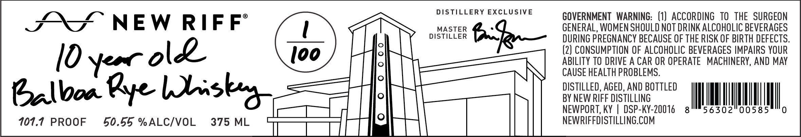

# TTB COLA Label Images - TTBID 26141001000680

**Brand Name:** NEW RIFF

**Issue Date:** 05/28/2026

**Origin Code:** 22

**Product Class/Type:** 142

**Source:** [TTB Public COLA Registry](https://ttbonline.gov/colasonline/viewColaDetails.do?action=publicFormDisplay&ttbid=26141001000680)

## Label Images

### Front Label

## Extracted Label Text

*Text extracted via OCR - may contain errors*

**Detected Proof:** 101.7

### Front Label

DISTILLERY EXCLUSIVE

GOVERNMENT WARNING: (1) ACCORDING TO THE SURGEON

XS” NEW RIFF

MASTER

GENERAL, WOMEN SHOULD NOT DRINK ALCOHOLIC BEVERAGES

DISTILLER

fas

DURING PREGNANCY BECAUSE OF THE RISK OF BIRTH DEFECTS

ie

(2) CONSUMPTION OF ALCOHOLIC BEVERAGES IMPAIRS YOUR

Oy cor lk

ABILITY TO DRIVE A CAR OR OPERATE MACHINERY, AND MAY

CAUSE HEALTH PROBLEMS.

DISTILLED, AGED, AND BOTTLED

BY NEW RIFF DISTILLING

Balboa Bye Ls

sky

T, KY | DSP-KY-20016 8

NM,

56302

101.7 PROOF

50.55 %ALC/VOL

375 ML

ty ||

NEWRIFEISTILING COM

ami

r | |
