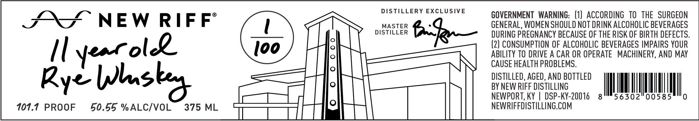

# TTB COLA Label Images - TTBID 26141001000682

**Brand Name:** NEW RIFF

**Issue Date:** 05/28/2026

**Origin Code:** 22

**Product Class/Type:** 142

**Source:** [TTB Public COLA Registry](https://ttbonline.gov/colasonline/viewColaDetails.do?action=publicFormDisplay&ttbid=26141001000682)

## Label Images

### Front Label

## Extracted Label Text

*Text extracted via OCR - may contain errors*

**Detected Proof:** 101.1

### Front Label

DSTILLERY EXCLUSIVE
GOVERNMENT   WARNING:  (1) ACCORDING  To   THE   SURGEON
NEW
RIF F=
MASTER
GENERAL, WOMEN SHOULD NOT DRINK ALCOHOLIC BEVERAGES
DISTILLER
6k
DURING PREGNANCY BECAUSE OF THE RISK OF BIRTH DEFECTS:
(2) CONSUMPTION OF ALCOHOLIC BEVERAGES IMPAIRS YOUR
1(
Ioo
ABILITY TO DRIVE A CAR OR OPERATE
MACHINERY, AND MAY
CAUSE HEALTH PROBLEMS.
Rye
DISTILLED, AGED, AND BOTTLED
BY NEW RIFF DISTILLING
NEWPORT, Ky
DSP-KY-20016
8
56302"00585
101.1
PROOF
50.55 %ALCIVOL
375 ML
NEWRIFFDISTILLING.COM
Yearolee
Ilsbo
