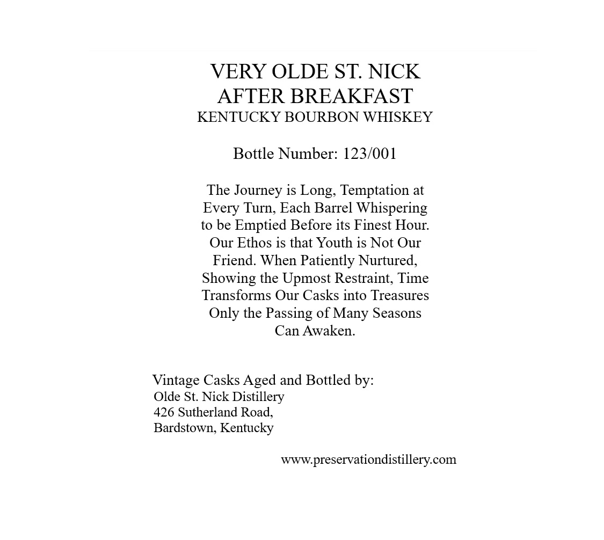
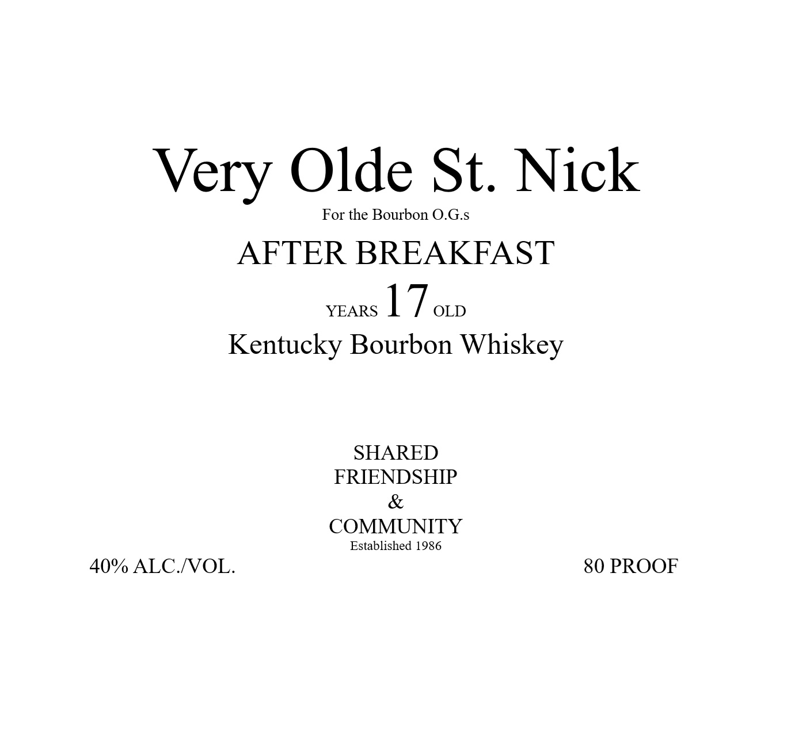

# TTB COLA Label Images - TTBID 26141001000699

**Brand Name:** VERY OLDE ST. NICK

**Issue Date:** 05/28/2026

**Origin Code:** 22

**Product Class/Type:** 141

**Source:** [TTB Public COLA Registry](https://ttbonline.gov/colasonline/viewColaDetails.do?action=publicFormDisplay&ttbid=26141001000699)

## Label Images

### Back Label

### Label 1

### Label 3

## Extracted Label Text

*Text extracted via OCR - may contain errors*

**Detected Proof:** 80

### Back Label

VERY OLDE ST NICK
AFTER BREAKFAST
KENTUCKY BOURBON WHISKEY
Bottle Number: 123/001
The Journey is Long; Temptation at
Every Turn, Each Barrel Whispering
to be
Emptied Before its Finest Hour:
Our Ethos is that Youth is Not Our
Friend. When Patiently Nurtured,
Showing the Upmost Restraint; Time
Transforms Our Casks into Treasures
Only the Passing of Many Seasons
Can Awaken
Vintage Casks Aged and Bottled by:
Olde St: Nick Distillery
426 Sutherland Road
Bardstown; Kentucky
wwwpreservationdistillery com

### Label 1

Very Olde St. Nick
For the Bourbon O.G.s
AFTER BREAKFAST
YEARS
17 OD
Kentucky Bourbon Whiskey
SHARED
FRIENDSHIP
COMMUNITY
Established 1986
40% ALC NOL.
80 PROOF

### Label 3

GOVERNMENT WARNING:
ACCORDING
TO
THE
SURGEON
GENERAL
INGmeR) AGSORDH
NOT
DRINK
ALcOHOLic
BEVERAGES
DURiNG
PREGNANCY
BECAUSE
OF
THE
RISK
OF
BIRTH
DEFFECTS
CONSUMpTION
OF
Alcoholic
BEVERAGES
IMPAIRS
YOUR
ABILITY
TO
DRIVE
A
CAR OR
OPERATE
MACHINERK
ANd
MAY
CAUSE
HEALTH
PROBLEMS.
UPC- FOR POSITION ONLY
750ML
